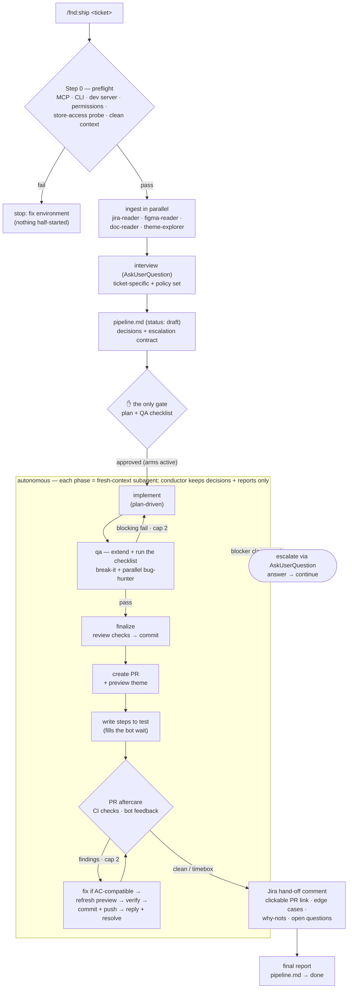

# Foundation — the fnd plugin

Domaine's **Agentic Assisted Development** skills, packaged as a plugin. It bundles the
Foundation workflow skills (technical approach → develop → QA → PR, plus translations,
breaking-changes, preview themes, etc.) for Shopify theme work.

**Claude Code is the canonical host**; the same content also runs on **Cursor**, **OpenAI Codex
CLI** and **OpenCode** through thin, committed adapters generated from it — one repo, no fork.
See [Install — four hosts](#install--four-hosts).

## What's inside

This repo is a **marketplace** (a catalog) that hosts one or more **plugins**, each
in its own subfolder under `plugins/`:

```
.
├── .claude-plugin/
│   └── marketplace.json         # marketplace catalog (lists the plugins)
├── plugins/
│   └── fnd/                      # the Foundation plugin (self-contained)
│       ├── .claude-plugin/
│       │   └── plugin.json       # plugin manifest (+ bundled mcpServers) — canonical
│       ├── .cursor-plugin/plugin.json   # Cursor manifest (same version stamp)
│       ├── .codex-plugin/plugin.json    # Codex CLI manifest (same version stamp)
│       ├── skills/               # 18 workflow skills (see table below)
│       │   ├── develop-feature-or-fix/SKILL.md
│       │   └── ...
│       ├── agents/               # subagents the skills delegate to
│       │   ├── change-reviewer.md   #  reviews a diff (hygiene + conformance)
│       │   ├── bug-hunter.md        #  adversarial bug hunt on a diff (correctness)
│       │   ├── jira-reader.md       #  reads a ticket → structured fields
│       │   ├── jira-writer.md       #  writes one approved field (ADF) / comment (md) → Jira
│       │   ├── figma-reader.md      #  reads one Figma frame → build spec
│       │   ├── doc-reader.md        #  reads one linked doc (Notion/Confluence/web) → extract
│       │   └── theme-explorer.md    #  scouts the theme → impact map
│       ├── hooks/                # injected conventions + git guards + context monitor
│       │   ├── comment-discipline.md
│       │   ├── lean-code.md      #  "lazy senior dev" ladder (FND_LEAN=0 to disable)
│       │   ├── subagent-conventions.sh  # injects the above into code-writing subagents
│       │   ├── no-verify-bypass.sh      # PreToolUse guard: no hook-bypassing commits
│       │   └── ...               # see "Hooks" below for the full set
│       ├── scripts/              # bundled runners the skills call
│       │   ├── shopify-admin-gql.sh #  Admin GraphQL (store execute → token)
│       │   ├── theme-json.sh        #  theme JSON / customizer state
│       │   ├── gen-host-adapters.cjs #  writes every generated dir below
│       │   ├── doctor.cjs           #  static install verification, any host
│       │   └── ...
│       ├── references/           # shared docs the skills read
│       │   ├── jira-custom-fields.md
│       │   ├── review-flow.md    #  shared contract for the review/marker flow
│       │   ├── host-model-map.md #  GENERATED — tier → model, per host
│       │   └── ...
│       ├── rules/                # Cursor rule bundle (vendored foundation .mdc + fnd rules)
│       ├── agents-cursor/        # GENERATED per-host agent variants — never hand-edit;
│       ├── agents-codex/         #   change agents/ (or the generator) and re-run
│       ├── agents-opencode/      #   scripts/gen-host-adapters.cjs
│       ├── commands-opencode/    # GENERATED /name shims (OpenCode invokes skills by model only)
│       ├── mcp.json              # GENERATED Cursor MCP config (+ mcp.pruned.json profile)
│       ├── mcp-codex.json        # GENERATED Codex MCP config (not `.mcp.json` — that
│       │                         #   name is a Claude Code plugin component)
│       └── opencode/             # OpenCode adapter + GENERATED model-profile examples
│                                 #   and mcp-fragment.json
├── scripts/
│   └── install.sh                # Cursor / OpenCode / Codex-subagent installer
├── docs/                         # per-host quickstarts (install · update · what differs)
│   ├── README.cursor.md
│   ├── README.codex.md
│   └── README.opencode.md
├── tests/                        # committed test suites for the hooks + scripts
│   ├── no-verify-bypass-matrix.sh   #  FP/FN contract of the two commit guards
│   ├── hooks-sim.sh                 #  SessionStart / monitor-gate / context-stats sims
│   ├── scripts-sim.sh               #  runner + theme-json + converter-caller sims
│   ├── adf-md-fixtures.mjs          #  ADF ↔ markdown converter fixtures
│   ├── json-slim-fixtures.mjs       #  mcp-slim pipeline + CLI + hook fixtures
│   ├── readme-checks.sh             #  README/docs: commands, paths, links, version markers
│   ├── fixtures/                    #  real captured payloads (secrets scrubbed)
│   └── parity/                      #  upstream-port parity fixtures + license NOTICE
├── LICENSE
└── README.md
```

To add another plugin later: create `plugins/<name>/` (with its own
`.claude-plugin/plugin.json`) and add an entry to `marketplace.json` → `plugins[]`.

> **Note on rules.** Project coding conventions (`css-conventions`,
> `liquid-conventions`, `protected-core`, …) are **not** shipped in this plugin.
> They live in the target repo under `.claude/rules/*.md` and auto-attach
> natively by their `paths:` globs when you edit matching files. The skills just
> say "follow the repo's coding rules" — the rules themselves come from the
> project. See [Skills + project rules](#how-global-skills-use-project-rules).

## Skills

| Skill | Invoke |
|-------|--------|
| `write-technical-approach`        | `/fnd:write-technical-approach` |
| `develop-feature-or-fix`          | `/fnd:develop-feature-or-fix` |
| `qa-feature-or-fix`               | `/fnd:qa-feature-or-fix` |
| `write-steps-to-test`             | `/fnd:write-steps-to-test` |
| `create-pull-request`             | `/fnd:create-pull-request` |
| `ship`                            | `/fnd:ship` |
| `preview-theme`                   | `/fnd:preview-theme` |
| `worktree`                        | `/fnd:worktree` |
| `pre-commit-review`               | `/fnd:pre-commit-review` |
| `commit`                          | `/fnd:commit` |
| `preflight-checks`                | `/fnd:preflight-checks` |
| `save-task-context`               | `/fnd:save-task-context` |
| `fix-accessibility-issue`         | `/fnd:fix-accessibility-issue` |
| `get-breaking-changes`            | `/fnd:get-breaking-changes` |
| `fix-breaking-changes`            | `/fnd:fix-breaking-changes` |
| `update-translations`             | `/fnd:update-translations` |
| `report-plugin-issue`             | `/fnd:report-plugin-issue` |
| `smoke-test`                      | `/fnd:smoke-test` |

Skills are also **auto-invoked**: Claude reads each skill's `description` and
runs the relevant one when your request matches — you don't have to type the
slash command.

The `Invoke` column is the Claude Code form. Elsewhere: `/<name>` on Cursor, `$<name>` on Codex
CLI, and on OpenCode either by description (its native `skill` tool) or `/<name>` through the
generated command shims. Auto-invocation by description works on all four.

## Install — four hosts

The same plugin content runs on **Claude Code** (canonical), **Cursor**, **OpenAI Codex CLI**
and **OpenCode**. Every route ends the same way: the installer (or `/plugin install`) leaves you
with a checkout, `doctor.cjs` says whether the host will actually load it, and one `smoke-test`
run in a live session proves the layers a script cannot reach.

The table is the one-line summary; the **Details** column links the full numbered walkthrough
for that host — starting from "the host CLI is not even installed yet" (prerequisites, sign-in,
which branch to check out), through every config paste, to the smoke test. If you are
installing for the first time, go straight to your host's doc and follow it top to bottom; the
sections below the table are the same story compressed for someone who has done it before.

| Host | Install | Verify | Details |
|---|---|---|---|
| Claude Code | `/plugin marketplace add …` + `/plugin install fnd@domaine` | `/fnd:smoke-test` | below |
| Cursor | Customize → Add Marketplace (or `./scripts/install.sh --target cursor`) | `/smoke-test` | [docs/README.cursor.md](docs/README.cursor.md) |
| Codex CLI | `codex plugin marketplace add …` **+** `./scripts/install.sh --target codex` | `$smoke-test` | [docs/README.codex.md](docs/README.codex.md) |
| OpenCode | `./scripts/install.sh --target opencode` | `/smoke-test` (command shim) | [docs/README.opencode.md](docs/README.opencode.md) |

`smoke-test` is a **run-once post-install check**, not a per-session routine: it runs the
doctor from inside the session, makes one cheap read-only call per configured MCP server,
spawns one subagent, attempts a `--no-verify` commit in a scratch repo expecting the host to
block it, and reports a pass/fail matrix with remediation. `preflight-checks` keeps the
recurring per-project role.

### Claude Code — from the published Git marketplace (team use)

```text
# 1. Add the marketplace (you'll get a trust prompt — confirm it)
/plugin marketplace add domaine-oleksandr-kever/claude-plugins

# 2. Install the plugin from it
/plugin install fnd@domaine

# 3. Activate without restarting the session
/reload-plugins

# 4. Prove the install once, in a session
/fnd:smoke-test
```

`/plugin marketplace add` shows a **trust dialog** the first time, because a
marketplace can ship hooks, commands, and MCP servers that run on your machine.
Review the source, then confirm to add it to your trusted marketplaces. To make
it trusted for a whole team without each person confirming, an admin can
predeclare it in managed settings under `extraKnownMarketplaces`.

### Claude Code — local development (from this folder on disk)

```text
/plugin marketplace add /path/to/claude-plugins
/plugin install fnd@domaine
/reload-plugins
```

Edits to skill files in a local marketplace are picked up on the next session
(or after `/reload-plugins`). See [Updating](#updating).

### Cursor

To **use** the plugin, no clone is needed: in Cursor, **Customize → Plugins → Add Marketplace**
with this repo's URL, then **Add** on the **fnd** card — Cursor installs into its own cache and
follows GitHub for updates (live-verified 2026-08-22). To **develop** it, or run unpushed work:

```bash
git clone https://github.com/domaine-oleksandr-kever/claude-plugins.git
cd claude-plugins
./scripts/install.sh --target cursor      # symlinks ~/.cursor/plugins/local/fnd
```

The installer pulls, links, and runs `doctor.cjs --target cursor` at the end — read those rows.
On either route, reload the Cursor window (*Developer: Reload Window*) so the manifest, hooks
and `mcp.json` load, and run `/smoke-test` once in a chat. Full walkthrough, update path and
host deltas: [docs/README.cursor.md](docs/README.cursor.md).

### Codex CLI

Two channels: the marketplace plugin carries skills, hooks and MCP; the TOML subagents are
linked by the installer, because no plugin-level agents channel is confirmed yet (spike M1b).
Without the second step every delegating skill hits an unknown agent.

```text
codex plugin marketplace add domaine-oleksandr-kever/claude-plugins
/plugins                                  # → install fnd
```

Then, from a clone of this repo:

```bash
./scripts/install.sh --target codex       # subagents only
```

Then two steps the install cannot perform for you — `[features] hooks = true` in
`~/.codex/config.toml`, and the per-content-hash trust review in `/hooks` — then a new session
and `$smoke-test` once (Codex invokes skills with `$`). The full walkthrough, including the
branch-ref form for the port's test phase and what re-triggers the trust review, is in
[docs/README.codex.md](docs/README.codex.md).

### OpenCode

From a clone of this repo:

```bash
./scripts/install.sh --target opencode    # skills, agents, commands, plugin adapter
```

The installer links into `~/.config/opencode/` and runs `doctor.cjs --target opencode`. Two
fragments stay yours to paste into your own `opencode.json` — the `mcp` block from
`plugins/fnd/opencode/mcp-fragment.json` and the `permission.bash` backstop from
`plugins/fnd/opencode/permission-fragment.example.json` — then start a new session and run
`/smoke-test` once (the command shim). Details, including the optional model-profile fragments:
[docs/README.opencode.md](docs/README.opencode.md).

### Verifying any install

`install.sh` runs the doctor for you at the end of every run; re-run it standalone whenever an
install stops behaving:

```bash
node plugins/fnd/scripts/doctor.cjs --target <cursor|codex|opencode>
```

It checks the install mode and symlink targets, that all three manifests carry the **same**
version stamp, that the generated dirs still match the generator, and that the hook scripts are
executable — the whole class of "the clone succeeded but the host will never load it" failures,
before any session. `smoke-test` then covers what a script cannot reach.

### What's different per host

The content is identical; the wiring is not. Claude Code is the baseline every column is read
against — nothing about it changed in the port — and each row is spelled out in full in the
per-host doc it belongs to:

| | Cursor | Codex CLI | OpenCode |
|---|---|---|---|
| Session statics | always-applied `rules/*.mdc` | `SessionStart` hook, as on Claude Code | your `instructions` config / `AGENTS.md` |
| MCP result handling | in-place rewrite (compress **and** spill-and-stub) | no output rewrite — spill-and-stub only, via `additionalContext` | in-place rewrite |
| MCP servers | all 6; `mcp.pruned.json` if the ~40-tool cap bites | all 6, no documented cap | all 6, pasted from `mcp-fragment.json` |
| Guard hooks | `beforeShellExecution`, deny + reason | `PreToolUse`; needs `[features] hooks` + `/hooks` trust; **absent on Windows** | `tool.execute.before` throw + `permission.bash` backstop |
| Subagents | 1 level → hoisted ship shape | hoisted, genuinely concurrent | hoisted unless `subagent_depth` raised |
| Models | pinned per the Domaine guidelines | pinned (PROPOSED map, sign-off pending) | **no pins** — session model; optional profile fragment |
| Skill invocation | `/name` | `$name` | model-invoked + `/name` shims |

Losses that hold on all three: no adversarial verify fan-out, no per-phase workflow telemetry,
and the context-usage monitor is inert wherever the host hands a prompt hook no transcript
(Cursor, OpenCode). `plugins/fnd/references/pipeline-phases.md` is the single home of the
orchestration fallback.

### Marketplace posture

- **Claude Code** — the git marketplace in `.claude-plugin/marketplace.json`, unchanged; this is
  how the team installs today.
- **Codex CLI** — this repo *is* a Codex marketplace: `codex plugin marketplace add <repo>` reads
  the same `.claude-plugin/marketplace.json` as a legacy-compatible location, so nothing separate
  is published.
- **Cursor** — this repo imports as a Cursor marketplace (Customize → Add Marketplace;
  live-verified 2026-08-22, installs into `~/.cursor/plugins/cache/…`); a root
  `.cursor-plugin/marketplace.json` is committed and mirrors the Claude one's identity. The
  local-symlink route (`~/.cursor/plugins/local/fnd`) stays as the development channel.
- **OpenCode** — no marketplace primitive exists; `install.sh` is the whole distribution channel.

### Plugin layer vs project layer

The plugin installs **once, in user space, and works in any project**; a project's own
skills/rules/agents sit on top and the two layers are **additive** on every host — a project
layer never disables the plugin, and the plugin never blocks project content. Three rules keep
that honest:

1. **Plugin content self-gates** — bundled rules stay glob-scoped or detection-gated, so the
   plugin is inert in a non-Shopify project instead of shouting theme guidance at it.
2. **Don't reuse fnd names project-side.** Skills are namespaced on Claude Code (`fnd:*`); the
   other hosts have no namespace, so a same-named project skill or agent is at best ambiguous.
3. **Hook wiring lives in exactly one layer — the plugin.** All layers fire on every host, so a
   project that re-declares an fnd hook gets a double run, not an override.

Conflicting *prose* is a docs problem, not a mechanism: no host offers hard precedence between
layers, so keep plugin rules generic-Foundation and let projects own their deltas.

### Managing it on Claude Code

```text
/plugin disable fnd@domaine    # keep installed, turn off
/plugin enable  fnd@domaine
/plugin uninstall fnd@domaine  # remove the plugin
/plugin marketplace remove domaine    # remove the marketplace
```

## Updating

No host silently updates on push, and there is **no proactive "new version available"
notification** anywhere. Two models cover all four hosts:

**Version-cache hosts — Claude Code and Codex.** The host clones from the git remote into a
version-keyed cache, so updating is an explicit command plus a new session:

```text
/plugin marketplace update domaine       # Claude Code, then /reload-plugins
codex plugin marketplace upgrade         # Codex, then a new session
```

- On Claude Code with **auto-update on**, the pull happens at startup and you are prompted to
  run `/reload-plugins`; toggle it per-marketplace in `/plugin` → Marketplaces. Third-party
  marketplaces default to **off**, hence the command above.
- **Unpushed commits are invisible** on both: they pull from the remote, never from your local
  folder. Push first, then update.
- The `version` field gates the update — an unbumped version can read as "nothing to update".
  `bump-version.cjs` (below) stamps every copy of it in one run.
- **Codex re-asks for hook trust** after any update that changes a hook command or its content,
  because the trust is per content hash. Until you re-approve in `/hooks`, the guard layer is
  dormant.

**Live-checkout hosts — Cursor and OpenCode** (and the Codex subagent half). The install points
at your clone, so re-running the installer *is* the update — it pulls and re-links in one pass:

```bash
./scripts/install.sh --target <cursor|opencode|codex>
```

- Skills, references, agents and scripts apply on the **next read**; manifest, hook-wiring, MCP
  and rules changes need a **window reload** (Cursor) or a **new session** (OpenCode).
- There is no "reinstall", and entries a rename or deletion removed upstream are pruned by the
  same run that pulled them.
- **`--copy` installs do not follow `git pull`** — re-run the installer to refresh one. The
  install report says which mode is active, and `doctor.cjs` fails a copy install whose recorded
  version has drifted from the checkout's.

The two models coexist on one machine without conflict — they read from different sources.

Nothing tells you an update exists, so `preflight-checks` carries the nudge: it compares the
installed version against what the host could install and — on Cursor and Codex — whether the
model ids pinned in that host's generated agents still resolve. Both rows are advisory; they
never gate a workflow.

## Releasing — one command stamps every version

Current release: **fnd v0.60.0**.

The version is duplicated across per-host packaging files, and a stamp that drifts
reads to a host as "nothing to update". One script owns all of them — run it instead
of hand-editing any manifest:

```bash
node plugins/fnd/scripts/bump-version.cjs minor      # or major | patch | 0.60.0
node plugins/fnd/scripts/bump-version.cjs 0.60.0 --dry-run   # report, write nothing
```

It stamps, all-or-nothing (a failure on any target writes nothing):

| Target | What is stamped |
|---|---|
| `plugins/fnd/.claude-plugin/plugin.json` | `version` — canonical, the base for `major`/`minor`/`patch` |
| `plugins/fnd/.cursor-plugin/plugin.json` | `version` |
| `plugins/fnd/.codex-plugin/plugin.json` | `version` |
| `README.md` | the markers `fnd v<semver>` and a double-quoted `FND_VERSION=` assignment |
| `scripts/install.sh` | every double-quoted `FND_VERSION=` assignment |

Only those two literal marker forms are recognized — a version written any other way
(`fnd 0.60.0`, `version: 0.60.0`) is silently skipped forever, so use them verbatim
when adding a version string to the docs. `docs/README.*.md` are deliberately **version-free**
for the same reason: they are not stamped targets, so a version literal there would drift on the
next release (`tests/readme-checks.sh` fails one). The flip side: every quoted `FND_VERSION=`
assignment in a stamped file becomes a constant, so a shell variable of that name must
be assigned unquoted.

Then verify the packaging before committing:

```bash
node plugins/fnd/scripts/doctor.cjs      # manifests present, versions equal, hooks runnable
bash tests/layout-assertions.sh
bash tests/readme-checks.sh              # install commands, referenced paths, links, stamps
```

## How global skills use project rules

A common question: *if the plugin is installed globally, do its skills still pick
up the project's rules?*

**Yes.** The skills do **not** hardcode paths to the rule files — they reference
"the repo's coding rules" in prose. The actual rules are loaded by the **project
context**, not by the skill:

- The plugin (global) provides the **workflow** — the steps of each skill.
- The target repo's `.claude/rules/*.md` provide the **conventions** — and
  Claude Code auto-attaches each rule when you touch a file matching its `paths:`
  glob (e.g. `css-conventions` when you edit a `*.css`).

So when you run a skill inside `elc-theme`, you get both at once: the global
workflow + the project's native rules. Run the same skill in a repo without
those rules, and the skill simply proceeds on general best practices. Bundled
`references/` docs (Jira field IDs, TA format) travel **with the plugin** and are
read via `${CLAUDE_PLUGIN_ROOT}`, so they always resolve regardless of install
scope.

## Concepts: commands vs skills vs agents

### Commands vs skills

Both are Markdown files with frontmatter; the difference is **who triggers them**
and **where they run**:

| | **Command** (`commands/*.md`) | **Skill** (`skills/<name>/SKILL.md`) |
|---|---|---|
| Trigger | **You** type `/name` explicitly | **You** type `/name` **or Claude auto-invokes** it by matching `description` |
| Best for | A fixed action you run on demand | A capability Claude should reach for when the task fits |
| Extra files | Single `.md` | A folder — can bundle `REFERENCE.md`, `scripts/`, etc. |
| Runs in | The main conversation | The main conversation |

Rule of thumb: if you want Claude to *decide* when to use it, write a **skill**
(it has a discoverable `description` and can carry supporting files). If you only
ever fire it manually, a **command** is the lighter option. This plugin ships
skills because the Foundation steps are things Claude should select on its own.

### Agents (subagents)

An **agent** is a separate Claude instance with its own context window, its own
system prompt, and its own restricted toolset. The main conversation **delegates
a self-contained task** to it; the agent works in isolation and returns only its
final result. Use them to (a) keep heavy/noisy work out of the main context, and
(b) run focused, read-only analysis with a tailored prompt.

A plugin ships agents as `agents/<name>.md`:

```markdown
---
name: change-reviewer
description: Reviews the branch's changed files (Liquid / TS / CSS) against Foundation conventions. Invoke before a commit or PR to catch core-file violations, stale comments, and schema mistakes.
model: opus
effort: medium
tools: Read, Grep, Glob, Bash
---

You are a Shopify theme reviewer for the Foundation codebase.

Given a set of changed files, check them against Foundation conventions:
- Never modify `src/entry/core/*` or `blocks/core-*.liquid` directly — flag any direct edits.
- Verify snippet params have LiquidDoc + defaults.
- Verify schemas are authored in `schemas/` (TS), not hand-edited in compiled output.

Return a concise findings list grouped by file, each with severity and a fix.
Your final message IS the result handed back — return data, not chatter.
```

**How it's used:**

- **Auto-delegation** — when your request matches the agent's `description`
  ("review my changes"), Claude spawns it automatically.
- **Explicit** — ask directly: *"use the change-reviewer agent on my staged
  changes."*
- **Isolation** — it can only `Read/Grep/Glob/Bash` here (no `Write`), so it
  analyzes without touching files. Add `isolation: worktree` if an agent must
  edit files in parallel without colliding with the main session.

Agents differ from skills: a **skill** runs inline in the main conversation and
steers *your* Claude; an **agent** is a *separate* Claude you hand a task to,
with its own context — ideal for parallel, sandboxed, or token-heavy subtasks.

**Shipped agents.** This plugin ships six subagents that are read-only toward their
sources (`doc-reader` writes only its own workspace extract), plus the write-side
`jira-writer` — all used to keep heavy/noisy work out of the main context:

- **`change-reviewer`** — reviews a diff (stale comments, refactors, project-rules
  conformance). The review flow fans it out one agent per file-group on large diffs.
- **`bug-hunter`** — adversarial correctness review of a diff: reads the base classes,
  event listeners, and sibling paths the change interacts with, and returns verified
  findings with concrete failure scenarios (races, merchant-invariant bypasses, state
  divergence). Spawned in parallel with `change-reviewer` (pre-commit), as the PR
  backstop, and alongside live QA in the ship pipeline.
- **`jira-reader`** — fetches a Jira ticket via the Atlassian MCP and returns clean
  structured fields (keeps raw ADF out of context).
- **`jira-writer`** — the write-side mirror: writes one **approved** value with a single
  call — a rich-text custom field via `editJiraIssue` (markdown converted to ADF first), a
  comment via `addCommentToJiraIssue` (markdown verbatim, `contentFormat: "markdown"`) — so
  the large payload stays in its disposable context, not the main loop. Writer skills
  delegate here **after** the ✋ approval (the gate stays in the skill; the agent never
  authorizes).
- **`figma-reader`** — reads **one** Figma frame via a Figma MCP (the remote/connector
  server when one is attached, else the local Dev Mode bridge) and returns a compact build
  spec. Spawned **one per URL, in parallel** when a ticket has several.
- **`doc-reader`** — reads **one** linked doc (Notion with sub-page follow-through,
  Confluence, or any web URL) and returns a task-focused extract, saving it to the
  workspace `doc-<slug>-<hash>.md` itself. Spawned **one per link, in parallel** — the raw pages
  never enter the main context (`references/reading-linked-docs.md`).
- **`theme-explorer`** — a planning scout: reads the project's `.claude/rules` + theme
  layout and returns an impact map (relevant files, patterns, new files, rule constraints).
  Finds breadth; the main loop reads the load-bearing files itself.

In `develop-feature-or-fix` these run **in parallel** during Phase 1 (ticket + design +
codebase reads at once) when the task scope is already clear. The block above is roughly
`change-reviewer`'s definition.

## Review flow (pre-commit / commit / PR)

`pre-commit-review`, `commit`, and `create-pull-request` share one review contract
(`references/review-flow.md`):

- **Split by files, not checks.** Mechanical checks (Jira task numbers, untracked
  referenced files) run inline; the judgement checks (stale comments, refactors,
  project-rules conformance) go to the `change-reviewer` agent — one for a small
  diff, one per file-group in parallel for a large one. Each file is read once.
- **Correctness pass.** When the diff touches JS/TS logic or Liquid control flow, the
  `bug-hunter` agent runs in parallel — an adversarial hunt for real bugs, each finding
  carrying a concrete failure scenario. Its primary home is `pre-commit-review`;
  `create-pull-request` is the backstop (runs it only if the marker shows the pass is
  missing or stale). Every correctness finding is dispositioned — fixed, justified as a
  named ceiling in the PR body, or explicitly waived — never silently dropped.
- **Once per branch.** A tiny branch-keyed marker at `<git-dir>/.fnd-review`
  (resolved via `git rev-parse --git-dir`, so linked worktrees work too; never
  committed, auto-overwritten) records that a branch was reviewed. The **first**
  review on a branch runs in full; **later** runs ask the developer
  `[ full / only changed files / skip ]`, so `commit` and PR creation don't
  redundantly re-review work that's already been checked.
- **PR conformance gate.** `create-pull-request` runs the agent with a
  conformance emphasis; a `protected-core` violation (a direct edit to Foundation
  core) is a **blocker** that stops the PR until resolved.

## Auto mode — `/fnd:ship`

One command from a ready ticket to an open PR: `/fnd:ship ELC-206`. It front-loads every
question into one batched interview, takes a **single approval** on the implementation
plan + QA checklist, then runs the whole series autonomously — escalating only per an
explicit blocker contract (missing access, AC contradictions, destructive actions outside
the pre-authorized list, `protected-core` blockers from the conformance review, scope
growth beyond the ticket, QA failures that survive the fix cap). The contract lives in
`references/pipeline-mode.md`, the phase briefs in `references/pipeline-phases.md` (loaded
only after the approval gate, so a run that stops there never pays for them).

The conductor session stays thin: the heavy phases run in **fresh-context subagents**
that re-read the per-ticket workspace, so long runs never depend on what survives context
compaction. Run ship with the **strongest session model available (Fable recommended)** —
the conductor deliberately stays on the session model while every phase agent is pinned
(`references/pipeline-mode.md` → Phase-agent models), so the model you pick upgrades the
planning/synthesis context without raising phase-agent cost. Ship writes the same
workspace artifacts and ticks the same `progress.md` rows as the solo skills — an
interrupted run continues with the solo series, no unwinding; re-running `/fnd:ship`
reconciles against ground truth (git, `gh pr view`, Jira) and resumes.

**When to use which:** the solo series when you want to steer each step (checkpoints,
offer-next); `/fnd:ship` when the ticket is well-specified (Description + AC + approved
TA + Figma node) and you want the PR, Steps to Test, and the review-bot round handled
end-to-end.



## Parallel ship via git worktree

A ship run owns the repo it starts in — a dirty tree, the dev server on port 9292, the
`theme =` line in `shopify.theme.toml` that the session-theme pin rewrites — and it owns
the session for the whole run. `plugins/fnd/scripts/worktree-setup.sh` moves the run into
a **linked git worktree** (shared `.git`, no clone, instant setup) so the main checkout and
the main session stay free for everything else:

```text
worktree-setup.sh <WORK-ID> [<base-branch>]     # default base: develop
worktree-setup.sh --remove <WORK-ID> [--force]
```

`<WORK-ID>` is a Jira ticket key (`ELC-206`) **or** a kebab-case slug
(`header-refactor`) — the same work-id the task workspace uses, because not every
worktree is ticket-shaped.

Create mode does the whole setup in one pass: the worktree as a **sibling** directory
(`../<repo>-<WORK-ID>`) on branch `feat/<WORK-ID>` off `origin/<base>` (a local `<base>`
when no remote-tracking ref exists) — an existing local
or remote branch of that name is checked out, never duplicated; `npm ci` when the repo has
a `package.json`; **copies** of the gitignored config a fresh checkout cannot have —
`shopify.theme.toml`, so the session preview theme id the pin step later writes into it
lands in the worktree and leaves the main checkout's dev environment alone (and a pin the
source checkout already carried is undone in the copy — `toml_unpinned=yes` — so this stream
starts from the shared dev theme rather than inheriting another stream's preview), and `.env`,
without which every Admin API read from the worktree would fail on a missing token; the
worktree's `.claude/tasks` **symlinked** to the main repo's, so the task workspace is shared
between the two checkouts and survives the worktree's removal (and git-excluded, so the
link never reaches a commit);
`.claude/settings.local.json` copied rather than shared (two sessions approving permissions
into one file would race); and a free dev port from 9293 upward, recorded as a `dev-port:`
line in the shared workspace so the ship session finds it — a port counts as taken when
something is listening on it **or** another work-id's workspace already recorded it, because
the dev servers only start later, by hand, in the new sessions. Re-running for the same
work-id is idempotent — an existing worktree just re-prints the hand-off block.

Its own port is half the isolation; the other half is its own **session preview theme**,
offered once at setup and used by the dev server, QA and the PR table alike — without it
both sessions would sync their branches into the single theme id the copied
`shopify.theme.toml` points at, and each would clobber the other's preview. See
[Session preview theme](#session-preview-theme). A theme per stream does not raise the
≈2-runs-per-store ceiling below: Shopify's rate limit is per store + token, not per theme.

`--remove` refuses a dirty worktree or a detached HEAD unless you pass `--force`
(the detached case prints the HEAD sha for recovery), and deliberately touches
neither the shared task workspace nor the preview theme (`create-preview-theme.sh` reaps
its own orphans).

`/fnd:worktree` is the thin skill in front of all this — it resolves the work-id from your
message or the conversation, runs the script, and relays its output verbatim.

The launch flow is three steps, and only the first happens in the session you're already
in:

```text
# 1. in the main checkout — the hand-off block it prints includes
#    the session theme id and the dev-server line, ready to paste
/fnd:worktree ELC-206

# 2. a NEW terminal
cd ../my-theme-ELC-206 && claude

# 3. inside that session
/fnd:ship ELC-206
npm run dev -- --theme <session-theme-id> --port 9293   # from step 1's hand-off
```

Step 2 is illustrative — paste the `cd` line the script prints (an absolute, quoted path)
rather than retyping it. The dev-server line is the one step 1's hand-off gave you, with the
id and port filled in: without `--theme` the server syncs the branch into the shared dev
theme the copied config still names.

A session cannot relocate itself into another directory, so the second terminal is yours
to open — nothing is auto-spawned. `/fnd:ship` knows about the split: started **in a
worktree** it says nothing, started **in the main checkout** it offers the isolation once
(and can run the setup script for you, then stops so you can move over) and takes "no" for
an answer.

**How many at once:**

- **≈2 ships per store.** Shopify's theme rate limit is per store + token, and a running
  `shopify theme dev` draws on the same budget as every preview-theme push — that
  contention is what produces half-broken previews. Two concurrent runs on one store is
  the practical cap, and it helps to stagger the preview-theme phase rather than starting
  both runs the same minute. Nothing new guards this: the preview script's throttle
  retries and its created-theme orphan reap remain the mitigation, and they already run.
- **Different stores don't contend** — there, parallelism is bounded only by your machine.
- **Usage limits are shared.** Every parallel session bills the same Claude subscription,
  so N ships burn the plan's limit ≈N× as fast. Worktrees buy isolation, not extra quota.

## Session preview theme

One work stream, one theme. `shopify theme dev -e dev` targets the theme id in
`shopify.theme.toml`, which is shared config — so two sessions on one repo push two
branches into the *same* remote theme and each overwrites the other's preview. `/fnd:ship`
and `/fnd:worktree` therefore ask once, up front, which theme the stream owns: create one
now (`create --name "[ELC-206] Kever | Domaine" --reuse`, the same naming convention the PR
table uses) or hand over an existing theme id. The answer is **pinned** into that session's
`shopify.theme.toml` and recorded as a `session-theme: <id>` line in the shared task
workspace's `notes.md`, next to the `dev-port:` line — a later `/fnd:ship` or
`/fnd:worktree` finds that line, stops asking, and silently re-runs `pin --theme <id>` so the
checkout it is standing in is pinned too (the workspace is shared between checkouts, so a
recorded id is not by itself a pinned one; re-pinning is a byte-level no-op).

From then on everything targets that one theme: the start command the skills hand you
becomes `npm run dev -- --theme <id> [--port <N>]` (explicit flag *and* pinned toml — belt
and braces), the qa phase **refreshes** the session theme for its `preview-theme` rows
instead of building a second one, and `create-pull-request` puts it in the theme-preview
table rather than auto-creating (a recorded session theme now outranks auto-creation in the
"Args win" precedence).

Pinning is a `create-preview-theme.sh` job; both forms validate the id against the store
and refuse the **live** theme. When the store listing is unavailable, the standalone `pin`
refuses outright (`error=theme_unverifiable`, config untouched — a pin persists, so it is
never applied unvetted; retry), while `create` / `refresh --pin-toml` proceed and flag it
with `warn=pin_unvetted`:

```text
create-preview-theme.sh pin --theme <ID> [--env <name>]           # pin only, no push
create-preview-theme.sh create --name "<NAME>" --reuse --pin-toml
create-preview-theme.sh refresh --theme <ID> --pin-toml
```

The rewrite is **scoped to one environment block**, because that is how the Shopify CLI
reads this file: `shopify theme dev -e dev` resolves `theme =` inside `[environments.dev]`,
not the first one in the file. The script pins the block named `dev`, else `development` —
by name only, so even a lone block with any other name is refused (`error=ambiguous_env`)
rather than guessed at, since writing a preview id over `[environments.production]` would
both lose that theme's id and leave the dev server unpinned. `--env <name>` says which one.
A toml with no `[environments.*]` blocks at all but uncommented top-level `theme =` /
`store =` keys is pinned at the top level (reported as `pin_env=-`). Blocks it doesn't
target are never touched.

Inside the chosen block the first uncommented `theme =` line takes the session id and the
value it replaced is kept right above it on a commented `# … # fnd:superseded` line (and
reported as `superseded_theme_id=`) — this file is gitignored, so an overwritten dev theme
id would otherwise be recorded nowhere. Duplicate `theme =` lines in the same block are
commented out with their values intact (their count reported as `commented_dupes=`), a block
with none gets one appended tagged `# fnd:session-theme` — session-owned, so a later pin
just replaces its value and unpinning deletes it — and re-pinning
the same id leaves the file byte-identical. Nothing else moves — the `password =` Theme
Access token included, which the script never prints or hands back. On `create` / `refresh`
the pin runs last, after the push succeeded, the id is re-vetted before it is written, and a
pin that fails is reported (`pin=failed`) rather than allowed to swallow the id of a theme
that now exists on the store.

Two consequences worth knowing. `create` takes the **customizer settings** from whatever
theme the toml points at (code always comes from your branch), so once the session theme is
pinned a later `create` reads its settings from the session theme itself rather than from
the shared dev theme — which is why the flow creates once and **refreshes** from then on,
and a refresh pushes code only, leaving the settings untouched. And a new worktree
deliberately starts **unpinned**: `worktree-setup.sh` copies the source checkout's config and
reverts every pin it finds there, both shapes — `fnd:superseded` markers restored,
`fnd:session-theme` lines deleted (`toml_unpinned=yes`; `=no` means the source was never
pinned) — so a second work stream inherits the shared dev theme instead of the first
stream's in-progress preview. (A hand-written theme id that `pin` reported `pin=unchanged`
on carries no tag and is not reverted.) Restoring a pin by hand is that same edit: uncomment
the `# … # fnd:superseded` line and drop the pinned line below it — an appended line tagged
`# fnd:session-theme` is simply deleted.

## Bundled MCP servers

The plugin declares the MCP servers the skills/agents use (`plugin.json` →
`mcpServers`): `atlassian` (Jira), `figma-dev-mode`, `shopify-dev-mcp`,
`chrome-devtools-mcp`, `playwright`, `notion-mcp`.

- **Install the plugin at user (global) scope** and these servers are available in
  **every** project — you don't need a `.mcp.json` in each repo.
- **Authentication is per-user and cached** (keychain): authenticate Atlassian / Notion
  **once** via `/mcp`; it persists across projects and sessions — no re-auth when you
  switch repos.
- `figma-dev-mode` is the local Dev Mode SSE server — it works whenever the Figma desktop
  app is open in Dev Mode (no auth). It is the **fallback**, not the only path: `figma-reader`
  prefers a remote/connector Figma server (`mcp__figma__…`, URL-driven, no desktop app) when
  one is attached at user/project scope, so either setup alone is enough.
- If you already have any of these configured at user/project scope, that scope wins; the
  plugin's declaration is harmlessly ignored.

> OAuth servers need a browser sign-in, so they're unavailable in headless/non-interactive
> runs.

### The same list on the other hosts

`plugin.json` → `mcpServers` is the **only** hand-maintained server list. Each other host
reads a generated translation of it, written by `scripts/gen-host-adapters.cjs` and committed
alongside the rest of the generated adapters — never hand-edit one, add the server to
`plugin.json` and re-run the generator:

| File | Host | Shape |
|---|---|---|
| `plugins/fnd/mcp.json` | Cursor | auto-discovered at the plugin root; `type: "stdio"` spelled out |
| `plugins/fnd/mcp.pruned.json` | Cursor | the priority profile below — a reference file, not loaded |
| `plugins/fnd/mcp-codex.json` | Codex CLI | `mcpServers`, carried as-is; the manifest points at it. Deliberately **not** `.mcp.json`: Claude Code reads that name as a plugin MCP component, so a Codex-only edit would change what Claude Code loads |
| `plugins/fnd/opencode/mcp-fragment.json` | OpenCode | argv-array `command`, `environment`, `type: local\|remote` — paste the `mcp` block into your own `opencode.json` |

**Cursor tool cap.** Cursor is community-reported to stop exposing tools past ~40 across all
connected servers; the six bundled servers are roughly three times that. `mcp.json` still
ships all six — the cap is unmeasured (an M1a spike item), and a cap we haven't seen is no
reason to hand you a smaller plugin. If you do hit it, `mcp.pruned.json` is the priority
list to fall back to: **atlassian** (every workflow starts at a ticket) → **shopify-dev-mcp**
(five tools for the whole Shopify docs + validator surface) → **chrome-devtools-mcp** (one
browser stack, picked over `playwright` for console/network/performance access) → **figma-dev-mode**;
`playwright` and `notion-mcp` are the two it drops. Applying it is a per-server toggle in
**Cursor Settings → MCP** — nothing in the checkout changes, and re-enabling a dropped server
is the same toggle back. (Overwriting `mcp.json` with the pruned copy works too, but it is
deliberate local drift: `doctor.cjs` and `gen-host-adapters.cjs --check` both report it, and
re-running the generator undoes it.) To change the cut for everyone, move `CURSOR_KEEP_RANKS`
in the generator and re-run.

Codex and OpenCode document no tool-count limit, so both get the full list. Two transports
are unverified until the host spikes and say so in their own files: the Figma **SSE** server
on Codex (fallback: drop it from `mcp-codex.json` and `codex mcp add` it per-user) and on OpenCode
(carried as a plain `remote` url).

## Live store access

Skills that need real store data call two bundled runners (`plugins/fnd/scripts/`):
`shopify-admin-gql.sh` (Admin GraphQL — `shopify store execute` on CLI ≥ 4.x with stored
`shopify store auth`, falling back to `SHOPIFY_ADMIN_TOKEN` from the project's gitignored
`.env`) and `theme-json.sh` (reads/writes a theme's JSON content layer — the customizer state —
hard-refuses writes to the live theme, and falls back to the project's Theme Access token when
Admin API credentials are absent). A session-start hook tells Claude these exist, so it
inspects real store state whenever that answers a question — research and debugging included,
not just AC verification. Details: `plugins/fnd/references/metafield-metaobject-setup.md` and
`plugins/fnd/references/theme-customizer-state.md`.

## Hooks

The plugin wires five hook events (`plugin.json` → `hooks`); every hook fails open — a
hook error never blocks work:

- **SessionStart** — injects the Foundation session conventions from `hooks/*.md`
  (comment discipline, lean code, live-store access, the task-workspace convention,
  report-plugin-defects-upstream, and routing oversized MCP results through the
  `json-slim` CLI).
- **SubagentStart** — `subagent-conventions.sh` re-injects comment discipline + lean code
  into code-writing subagents; read-only readers are skipped.
- **PreToolUse (Bash) — two deterministic git guards.** `no-verify-bypass.sh` blocks
  every way of getting past the repo's git hooks: `--no-verify` on a commit, push,
  merge, `am` or pull (plus `-n`, which is that flag on a commit only), `core.hooksPath`
  and `GIT_CONFIG_*` redirects (read-only config *reads* stay allowed), and disabling the
  hook files themselves — `rm` / `mv` / `chmod -x` / truncate / in-place edit / redirect,
  and `HUSKY=0`. Its FP/FN contract lives in `tests/no-verify-bypass-matrix.sh`.
  `no-ai-attribution.sh` blocks AI-attribution trailers in commit messages.
- **UserPromptSubmit** — one node process (`user-prompt.cjs`) running two independently
  gated halves; a block from the guard wins over the monitor's notice. `context-stats.cjs` monitors
  context-window usage and warns (recommending `/compact`) past a threshold. Knobs, set
  like `FND_LEAN` in `settings.json` → `env`: `FND_CTX_MONITOR=0` turns it off,
  `FND_CTX_WARN` sets the warn threshold in % (default 40), `FND_CTX_WINDOW` overrides the
  assumed window size (e.g. for 1M-token sessions). `prompt-json-guard.cjs` keeps a large
  pasted JSON blob out of the conversation: a prompt over ~10 KB that carries a parseable
  JSON blob over ~8 KB is **blocked** (the prompt is erased, never reaching the model), the
  blob is spilled to a file (the active task workspace `tmp/`, else a private temp file),
  and the developer is shown that path to resubmit against — so the JSON is read with
  jq/Read on demand instead of sitting in context every turn. `FND_PROMPT_JSON=0` disables
  it.
  - **PostToolUse (`mcp__.*`)** — `mcp-slim.cjs` compresses large MCP tool results before they
    enter context (`scripts/json-slim.cjs`: ADF→markdown, noise-drop, long-string truncate,
    same-shape-array crush). Results ≤ 4 KB and error envelopes (`isError` / `errors[]`) pass
    through untouched; the original is spilled to a file and referenced by a `<<full=…>>` handle
    so nothing is lost. Stale spills are swept by an mtime TTL (`FND_MCP_SLIM_TTL`). `FND_MCP_SLIM=0`
    disables it; `FND_MCP_SLIM_DIR` sets the spill directory. A result **over** the platform limit
    (`MAX_MCP_OUTPUT_TOKENS`, ~25k tokens) bypasses this hook — Claude Code spills it to a file and
    hands over the path; the session convention and the reader agents route that file through the
    same compressor on demand (`node scripts/json-slim.cjs <path>`, `--stats` to see the cut). If that
    file isn't JSON — or holds an error envelope (never compressed) too big to print inline — the CLI
    hands the path back instead of re-dumping it, so the caller reads it directly; a smaller error
    envelope prints, and a narrowing `--jq` always prints (the file path does not answer a sub-value).
    A payload a tool **wrapped in a markdown fence** (prose preamble + ```` ```json ````
    … ```` ``` ````, e.g. chrome-devtools `evaluate_script`) is unwrapped first when the fenced body
    is the dominant content (≥ 80 % of bytes) and its body re-run through the pipeline with the
    preamble kept on top; a real doc with a small code block stays below that bar and passes through
    byte-identical. A spilled MCP result keeps its **content-block envelope**
    (`[{"type":"text","text":"<the payload, JSON-encoded>"}]`) — a one-element array whose single
    escaped string no pipeline stage and no `--jq` walk can descend into. The CLI
    unwraps a **pure, single-block** text envelope (a block carrying `_meta` / `structuredContent` /
    `annotations` is left alone — unwrapping would drop it; so is a MULTI-block envelope, whose blocks are
    independent results, not one document) whose inner payload is JSON, slims that, and
    prints the INNER body with one stderr line saying so; an inner that does not slim declines with
    the whole original. `--jq` walks the envelope FIRST (`--jq 0` / `--jq 0.text` still resolve
    to the block) and re-runs the walk inside the payload only when the first segment misses — a miss at
    both levels reports the payload's keys, not `length: 1`. `--jq .` (identity) still dumps the document
    it was given. A JSONL payload inside an envelope profiles like any JSONL, against a spill of the
    unwrapped body — the line recipes must address rows that really exist as lines.
    A **JSONL** file (one JSON object per line, e.g. a Shopify bulk-operation dump) is
    handled apart: the CLI never compresses it and never prints its rows — at ANY size it returns a
    **PROFILE** (row + parse-failure counts, per-key `{present, null, type, distinct}` — plus
    `distinctCapped` once a key's value set hits the retention cap, so `distinct` reads as a floor — and
    head/tail/reservoir sample rows) plus guidance to query the ORIGINAL file by line — a `readline` filter (the
    sample rows show the shape to write it against) or `sed -n '<N>p'` / `grep`. The `readline` template rides on
    the **first** profile of a given file per session; a repeat profile of the same file keeps the file, the row
    count, any fence offset and the `sed`/`grep` forms but drops the template (`FND_WHALE_GUIDE`). Never raw-`Read` a big
    JSONL: a sampled subset can't answer analytical questions whose answers live in rows the sample skips.
    On a file with a fresh key name on every row (an id-keyed map dumped one row per line) the profiler
    stops tracking new keys past a build cap and says so: `keysCapped: true`, and the dropped-key count
    comes back as `keysTruncatedAtLeast` (a FLOOR) instead of the exact `keysTruncated`.
    Files ≤ 8 MB profile the parsed rows; larger ones stream via `readline` (never loaded whole) — the
    same PROFILE either way. `--jq <dot.path>` extracts a single value from a ≤ 8 MB JSONL; on a larger one it
    is refused (it would re-read the whole file). The path is a **plain dot walk** (`products.0.title`);
    a leading `.` and `[N]` indices are accepted as the same thing (`.products[0].title`), while quoted
    keys and real jq filters are not supported. A path that doesn't resolve still prints `null` on stdout,
    but names the failing segment on stderr with what WAS addressable there
    (`--jq: 'produtcs' not found at top level; keys: products`) — a value that is genuinely `null` stays
    silent. **Log-shaped text** (build/test output, console spam,
    stack traces) is compressed by signal selection instead — errors, stack-trace heads, and summary
    lines are kept while repeated INFO/WARN spam is deduped `×N` and everything else is dropped to a
    `[N lines omitted: …]` trailer (on a file the CLI names the on-disk original for recovery); prose,
    markdown, and XML fall below the log detector's threshold and pass through unchanged. A **Figma
    design-context** payload (dev-mode `get_design_context` — generated React/Tailwind JSX) is compacted
    losslessly instead: repeated `className` strings move to a legend on top (`class=C17` at the use
    sites), `data-node-id` attributes become `#n17` refs whose full-id map is spilled to its own file so
    the ids stay usable for follow-up Figma calls, and identical repeated sibling subtrees fold to one
    exemplar plus a list of what differed per repeat (~77 % on a real 211 KB section — 219 KB as the
    captured envelope → 77.3 %) — the original is
    in the spill, and generic HTML/XML/Liquid never matches the detector. A **non-JSONL**
    JSON document keeps the normal slim behavior, plus a guard: if its slimmed body still exceeds ~48 KB it is spilled to a `fnd-slim-out-*`
    file and handed back as a one-line summary + the first element + both paths (`--jq <dot.path>` to narrow),
    never dumped inline. A result the pipeline **cannot** shrink under ~32 KB — incompressible text/HTML,
    already-minimal JSON, or a compressed body that is still huge — is not handed to the model raw: it is
    **spilled and stubbed**, i.e. replaced by a ~1 KB note naming the file, its format and shape, and the
    `node scripts/json-slim.cjs <path>` line to run on it (the same contract the session convention states
    for platform-spilled whales). The spill holds the payload itself, so that command really works on it.
    A content array whose blocks carry anything beyond `type`/`text` (an `annotations` or per-block
    `_meta` cursor) cannot be collapsed into one stub without losing those fields, so each **over-limit
    block is replaced on its own** instead: the array keeps its length, every block keeps its own fields,
    and each replacement names the spill holding *that block's* text. A block in that array that came back
    *compressed* and under the threshold rides along with its own `full=` handle, so nothing there reaches
    context lossy without a copy on disk.
    Never stubbed — these pass through as before: error results (including an error envelope sitting
    anywhere in a content array, at any size); anything carrying **binary** bytes — an image, audio or
    embedded-resource block, or any block *not* typed `text` that carries a `data`/`blob` string (a
    screenshot must still render, and a text spill would not hold it; a `type:"text"` block with an
    unrelated `data` sibling is still text and still stubs); the platform's own overflow notices;
    shapes the compressor did not understand; a failed spill. `FND_MCP_SLIM_STUB=0`
    turns the guard off; `FND_MCP_SLIM_STUB_BYTES` moves the threshold (never below the stub's own size).
    The whole flow also runs under a wall-clock ceiling (`FND_MCP_SLIM_BUDGET_MS`, default 5 s), and an
    expiry hands the ORIGINAL back — never a half-transformed value — **per block**: on a content array
    the blocks already slimmed keep their compression *and* their recovery handle while the rest ride
    verbatim, logged as `compressed` plus `budget_partial: true`. Only a whole-result expiry (a single
    text payload, or an array where nothing got through) is logged `budget-exceeded` — and above the stub
    threshold that bail is stubbed like any other whale, unless it turns out to be an overflow notice.
    With this guard in place, raising
    `MAX_MCP_OUTPUT_TOKENS` in your own `settings.json` `env` (so bigger results reach this hook instead of
    the platform's file spill) is safe — but it stays *your* decision, ideally after a week of `--report`
    data. **Why wasn't a result compressed?**
    set `FND_MCP_SLIM_DEBUG=1`, re-run, and read `<FND_MCP_SLIM_DIR>/fnd-mcp-slim-debug.log` — one
    JSONL line per call records the `decision` (`compressed` / `stubbed` / `passthrough`) and, on a
    passthrough, the `reason` (`error-shape`, `non-json`, `unrecognized-shape`, `no-gain`,
    `marker-overhead` (the win was smaller than the `full=` recovery handle, so the original was handed
    back), `budget-exceeded` (the wall-clock ceiling above),
    `platform-overflow` — the platform's own over-limit notice, whose `spill` field holds the
    file it saved the whale to; plus `size-gate` for a result under the 4 KB gate, which is *sub-gate
    noise* — three quarters of a real week's lines — and is therefore recorded only at
    `FND_MCP_SLIM_DEBUG=2`, the everything level). `no-gain` — the most common one — means the pipeline
    ran and produced byte-identical output, most often on a uniform array of **unique entities**: same
    keys on every row, per-row distinct ids / handles / URLs / titles, no error row, no low-cardinality
    status column, no numeric outlier or change-point. Sampling such an array is refused *by design*
    (`unique_entities_no_signal`, the same gate the upstream crusher ships): every row a 15-row sample
    dropped would be unique content, so the sample would misrepresent the result — and nothing else is
    compressible without re-encoding the table. The identical shape *does* crush once a signal appears
    (an error row, a status enum, a numeric column with an outlier), which is why one dump can report
    0 % and its next page 99 %. Above `FND_MCP_SLIM_STUB_BYTES` the spill-and-stub guard is what
    protects context here — and because a second whole-file run would only print the same bytes back, that
    stub names the narrowing command (`--jq <dot.path>`) instead of a bare re-run; below the threshold the
    result lands in full and `--jq` narrows it. On a `stubbed` line the
    `reason` instead names the branch the stub replaced (`non-json`, `no-gain`, `weak-gain` — a
    compression that stayed over the threshold — or `budget-exceeded`). Lines that wrote files also list them in
    `spills` — the call's own `full=` copy plus the crush / node-id-map spills written inside it, and on
    a CLI run Gate A's `fnd-slim-out-*` body plus, for a **stdin** run that came back lossy, the copy of
    the original it spilled and named on stderr (a file run hands the file itself back instead)
    (`spills_n` when that list is capped at 8); a line with **no** `spills` key left nothing on disk.
    In the **hook**, every branch that *discards* the compressed body (a stub, a `no-gain` or
    `marker-overhead` passthrough) also deletes the spills it created for that body — nothing names them
    any more — and splices them out of `spills`, so the list only ever holds files that are still on disk;
    a spill that already existed is left alone, since an earlier call's live handle may name it. A CLI run
    does no such cleanup: what a declined branch there left behind (a crush spill written before the run
    degraded to a passthrough) waits for the TTL sweep. Spill filenames are content
    hashes, so the same payload passing through twice reuses one file instead of adding another. Each line
    also records the `lvl` it was collected at (see `FND_MCP_SLIM_DEBUG`). **What did it all add
    up to?** `node scripts/json-slim.cjs --report [logfile] [--since <ISO>]` (default: the log above)
    prints totals, counts per decision/reason/stage, the top hook tools by bytes saved (CLI runs, keyed
    by file path rather than tool name, get one aggregate line — with the whole-file runs that reduced
    *nothing* counted separately, since those read a file into context for no gain; a `--jq` run is
    excluded, it answered a sub-path), per-project subtotals, how many
    DISTINCT spill files the window left behind (paths are deduped across events, so the content-hash
    reuse above shows up as one file, not one per call),
    and the **missed whales** — `platform-overflow` results no later `json-slim` run ever compressed.
    Results that were **stubbed** (above) get their own line and count as bytes saved, never as missed
    whales; a stub whose follow-up run gained nothing is called out there too. Totals collected at level 1
    are labelled as such (the sub-gate lines are missing from them, which inflates the %), and a log that
    straddles a switch between levels is flagged as not comparable instead of averaged — missed whales,
    stubs and stage counts are complete at every level. A `non-json` line also carries a
    `format` tag (`html` / `xml` / `broken-json` / `text`) so you can see WHAT slipped past the
    JSON-only pipeline (`grep '"format":"xml"' fnd-mcp-slim-debug.log`); every line carries a
    `project` tag — the nearest `.git` ancestor of the call's own cwd, else `CLAUDE_PROJECT_DIR`, else that
    cwd's basename — since the log is shared per-user across projects
    (`grep '"project":"my-repo"'`). The `.git` walk leads because Claude Code exports
    `CLAUDE_PROJECT_DIR` to hooks but not to the Bash tool, so it is the one rule both the hook and the CLI
    can follow; a CLI run from a scratch dir outside any repo still tags that dir. *Coexistence:* if you also run
    [`squeez`](https://github.com/claudioemmanuel/squeez), both its PostToolUse hook and `mcp-slim`
    fire on `mcp__*` results — expect them to stack.

### Environment switches

Single home for every knob the plugin reads, on every host. Every new switch must be added to
this table — with its per-host behavior whenever the switch does not mean the same thing
everywhere.

**Where to set them.** Two **Domaine env files** work identically on all four hosts — every
fnd entry point (Node hooks, the `json-slim` CLI, the two Shopify shell scripts, the OpenCode
plugin) reads them first thing, so a GUI-launched Cursor no longer needs `launchctl` gymnastics:

- global — `~/.config/domaine/env` (Windows: `%APPDATA%\domaine\env`; `$XDG_CONFIG_HOME` honored)
- per-project — `<repo>/.claude/domaine.env` (found by walking up from the working directory)

Precedence is **process env > project file > global file > default** — a value already in the
real environment is never overridden, so Claude Code's `settings.json` → `"env": { … }` (global
or per-project) keeps working and keeps winning. The file format is a strict `KEY=VALUE` subset:
one pair per line, `#` full-line comments, value = everything after the first `=`, no quoting
and no `$VAR` expansion. Only `FND_*` keys (plus `SHOPIFY_ADMIN_GQL_QUIET`) are read — the file
can never smuggle `PATH` or `NODE_OPTIONS` into a hook. Edit the files by hand or through the
CLI:

```bash
node plugins/fnd/scripts/domaine-env.cjs list                            # switches, values, which source won
node plugins/fnd/scripts/domaine-env.cjs set FND_MCP_SLIM_DEBUG=1        # global
node plugins/fnd/scripts/domaine-env.cjs set FND_MCP_SLIM_DEBUG=1 --project   # this repo only
node plugins/fnd/scripts/domaine-env.cjs unset FND_MCP_SLIM_DEBUG        # and: path [--project]
```

The CLI is never installed on its own — it ships inside the plugin (bare Node, no
dependencies) and lives wherever the plugin does: the clone, or the host's plugin cache.
The intended route is to **ask the agent in a session**: say "enable mcp-slim debug for
this project" or "turn off the prompt-JSON guard globally", and the session runs the
matching `set`/`unset` against the script under its own plugin root — no path to remember.
Running it by hand from the plugin directory works exactly the same.

Two caveats. The shell fast-gates in the hook wirings (the `[ "$FND_MCP_SLIM" = "0" ] && exit`
short-circuits) see only the real process env — a file-set `0` still disables the feature (the
Node side re-checks after loading the files), it just no longer skips the node spawn. And
`FND_LEAN`'s session gate is pure shell (the sessionStart one-liners that `cat` the statics), so
that one switch is process-env-only where it is hook-gated — on Cursor our sessionStart hook
also hands the file values back to the host, which then feeds them to every later hook of the
session, shell gates included.

Hooks never read a project's `.env` file on any host.

Five switches do not mean the same thing on every host — `FND_LEAN`, `FND_CTX_MONITOR`,
`FND_MCP_SLIM`, `FND_MCP_SLIM_STUB` and `FND_PROMPT_JSON`. Each of those rows carries a **Host
divergence** note; every other switch behaves identically everywhere, because the script that
reads it is the same single copy on all four hosts.

| Variable | Default | Effect |
|---|---|---|
| `FND_LEAN` | `1` | `0` disables the lean-code session convention. Hook-gated, so it applies where the convention arrives through a hook (Claude Code and Codex at session start; every host's subagent conventions on Claude Code, Cursor and Codex). On Cursor the SESSION copy ships as an always-applied rule instead — turn `rules/fnd-lean-code.mdc` off there — and on OpenCode the statics live in your own `instructions` config, which this switch cannot reach; either way, "normal mode" in the session still works |
| `FND_CTX_MONITOR` | `1` | `0` disables the context-usage monitor; node still spawns for the prompt-JSON guard unless `FND_PROMPT_JSON=0` too (both halves share one UserPromptSubmit process). **Host divergence:** the monitor reads the session transcript, which only Claude Code and Codex hand a hook — on Cursor (`beforeSubmitPrompt`) and OpenCode (`chat.message`) there is no transcript path, so the monitor is inert there whatever this is set to, and the switch only governs the prompt-JSON half |
| `FND_CTX_WARN` | `40` | context warn threshold, % of the window |
| `FND_CTX_WINDOW` | auto | override the assumed context window size (tokens) |
| `FND_MCP_SLIM` | `1` | `0` disables the MCP result compressor (PostToolUse `mcp-slim` hook) — node never spawns. **Host divergence:** Claude Code, Cursor and OpenCode all rewrite the result in place, so compression AND spill-and-stub both land. Codex cannot rewrite a tool result, so `hooks/codex-mcp-shim.cjs` drops every compressed body (adding it would only grow context) and forwards the spill-and-stub half as `additionalContext` — with `1` you get whale offloading there, never compression |
| `FND_MCP_SLIM_DIR` | `os.tmpdir()` | directory where `json-slim` and the `mcp-slim` hook spill offloaded rows / the original result (the `full=<path>` handle) |
| `FND_MCP_SLIM_TTL` | `24` | hours a spill file survives before the exit-time sweep prunes it (by mtime, so `full=` handles outlive same-day resume); `0` disables the sweep; any invalid value falls back to `24` |
| `FND_MCP_SLIM_DEBUG` | off | opt-in: append one JSONL trace line per `mcp-slim` / `json-slim` invocation to `<FND_MCP_SLIM_DIR>/fnd-mcp-slim-debug.log` (project, `lvl`, decision, reason, `format` on non-json, `narrowed` on a `--jq` CLI run, `guide` (`full`/`reminder`) on a JSONL profile, `budget_partial` on a mid-array wall-clock expiry, bytes, %, stages, `spills` — never any payload); rotates one generation at ~5 MB. `1` (or `true`/`yes`/`on`) = **key events**: everything except the sub-gate `size-gate` lines for results under the 4 KB gate, which were ~76 % of a real week's log. `2` (any integer ≥ 2) = **everything**, sub-gate lines included. Unset / `0` / `false` / an unrecognized value ⇒ no file written. The level rides on each line as `lvl`, so `--report` can say which of its numbers cover a partial event set — a `1` window's totals % is not comparable with a `2` window's |
| `FND_MCP_SLIM_STUB` | `1` | `0` disables the spill-and-stub guard: a result the compressor cannot bring under the threshold is then handed to the model raw again, instead of as a ~1 KB stub + spill. **Host divergence:** on Codex the stub is the only half of `mcp-slim` that survives (no output rewrite there), forwarded as `additionalContext` — so `0` on that host means a whale lands in context with nothing said about the spill that holds it |
| `FND_MCP_SLIM_STUB_BYTES` | `32768` | bytes above which the `mcp-slim` hook spills-and-stubs instead of passing a whale through (also applies to a compressed body that is still this large); any invalid value falls back to `32768`, never to `0`, and any value below the stub's own ~1.2 KB is raised to it (a smaller gate could emit a stub bigger than the text it replaces) |
| `FND_MCP_SLIM_BUDGET_MS` | `5000` | wall-clock ceiling for one `mcp-slim` compression run (shared across every block of a result). An expiry hands the ORIGINAL back — per block, so a partly-slimmed content array is logged `compressed` + `budget_partial`, and a whole-result expiry `budget-exceeded` (stubbed above the stub threshold); `0` disables the ceiling; any invalid value falls back to `5000`, never to `0`. The default is ~22× a 1 MB-class payload on this pipeline and well inside Claude Code's PostToolUse timeout — headroom, not a guarantee: a genuinely huge result (tens of MB, or several fat blocks sharing the one deadline) can still reach it, and is then handed back uncompressed rather than half-compressed |
| `FND_WHALE_GUIDE` | `1` | `0` (or `false`/`no`/`off`) disables the one-shot rule for `json-slim`'s whale-recovery guidance: the full block (readline filter template + `sed`/`grep` single-row hints) is then printed after every profile instead of only the FIRST profile of a given file per session. With the default, later profiles of the same file carry a one-line reminder that stays self-sufficient — the file, the row count, any fence offset, the `sed`/`grep` single-row forms and this switch — dropping only the readline template (the reader of a repeat may be a subagent, or a context that was compacted since). The suppression state is a dotfile per session × **resolved** file path under `FND_MCP_SLIM_DIR`, expires after 2 h, and is pruned by the same sweep as the spills (so `FND_MCP_SLIM_TTL=0`, which disables that sweep, leaves the small per-file **state files** in place); a new file path, a missing, unreadable or future-dated state file always yields the full block. The profile itself is never affected, and each profile's debug line records which variant it printed (`guide: full` / `reminder`) |
| `FND_NOGAIN_MEMO` | `1` | `0` (or `false`/`no`/`off`) disables `json-slim`'s per-file no-gain memo. With the default, a **file** run that printed its body back unchanged (a deliberate decline, now also stated on stderr) is remembered — per session × **resolved** file path, for 2 h, invalidated as soon as the file's size or mtime change — and a repeat run on that file answers with a one-line refusal naming the recovery instead of re-printing the body; the field pattern it removes is "decline → immediate re-run", where a 0 % result reads as a failed attempt. Only declines of at least 4 KB are remembered (below that a refusal saves nothing). The state is dotfiles under `FND_MCP_SLIM_DIR`, swept with the spills (so `FND_MCP_SLIM_TTL=0` leaves them in place); a missing, unreadable, corrupt or future-dated state file always yields the normal run. The same switch also governs the second refusal, which needs no memo: `fnd-slim-out-*` files — `json-slim`'s own Gate-A output spills, already slimmed — are answered the same way (only below the 8 MB stream gate; past it the big-document guidance is the useful answer). Neither refusal ever applies to a run whose answer they cannot stand for: a narrowing `--jq <dot.path>` (the documented recovery after a decline), `--stats` (a measurement run, which must report its 0.0 %), and the pipeline flags `--toon` / `--no-spill` all bypass both — and a decline under a pipeline flag is never remembered either. The stderr decline notice is NOT governed by this switch: it rides on every file run that printed the file's own bytes back unchanged. Both refusals log `already-slim-out` / `no-gain-memo` and are counted on `--report`'s `cli runs:` line |
| `FND_PROMPT_JSON` | `1` | `0` disables the prompt-JSON guard (UserPromptSubmit `prompt-json-guard` half); node still spawns for the context monitor unless `FND_CTX_MONITOR=0` too — with both at `0` no node process runs at all. **Host divergence:** on OpenCode nothing can erase a message, so a blocking verdict **rewrites** the prompt instead — every blob the guard spilled is replaced in place by its `full=` handle, which offloads the paste exactly as elsewhere |
| `SHOPIFY_ADMIN_GQL_QUIET` | off | non-`0` value shortens the gql runner's engine-fallback note to `note=engine=token` |
| `FND_GQL_PROBE_CACHE` | `21600` | seconds the gql runner reuses its two sticky machine facts — the `shopify version` probe (~1.5 s, also invalidated whenever the CLI binary is newer than the cache) and "`store execute` is unavailable for this store", which lets a later call skip the doomed probe entirely. `0` re-probes on every call — the escape hatch right after a `shopify store auth`; any invalid value falls back to `21600`. Both caches live in a 0700 per-user dir under `$TMPDIR`; `--engine store` ignores the second one and always attempts |
| `FND_CPT_THROTTLE_WAITS` | `20 60` | pause(s), in seconds, between `create-preview-theme.sh`'s push retries after Shopify answers `Throttled` — the store+token rate limit is shared with a running `shopify theme dev`, so a bulk push can 429 while everything else is healthy. One retry per listed value; empty disables retrying (tests pass `0 0`) |
| `TOML_PATH` | `shopify.theme.toml` | path the theme scripts read their config from — `store =` (all three), the dev-theme id `theme =` (`create-preview-theme.sh` only; must resolve to a NUMERIC id — a theme name is refused, since names are not unique on a store and a mis-parse would orphan a created theme; the `pin` subcommand is the exception, deliberately allowed to run on an absent or malformed `theme =` line precisely to repair it), the Theme Access token (`create-preview-theme.sh`, `theme-json.sh --engine themecli`). Point it at a single-environment file when a multi-environment toml would otherwise resolve to the first `[environments.*]` block listed. Also the **write** target of `create-preview-theme.sh`'s session-theme pin (`pin` / `--pin-toml`), which rewrites the `theme =` line of one environment block via an atomic same-directory replace — permissions and the symlink target are preserved, the inode is not — so point it at a copy when the real config must not be touched |
| `SHOPIFY_CLI_THEME_TOKEN` | unset | Theme Access token for the `shopify` CLI. `create-preview-theme.sh` reads it as a LAST resort (the repo's own `password =` wins, so a token exported for another project cannot authenticate this repo's pushes against that store); `theme-json.sh --engine themecli` prefers it over the toml. Both export it into the CLI subprocess and never print it |
| `SHOPIFY_STORE` | unset | store handle/domain used by `theme-json.sh` and `shopify-admin-gql.sh` when `--store` is not passed, ahead of the toml's `store =` |
| `SHOPIFY_ADMIN_TOKEN` | unset | Admin API access token for the gql runner's token engine, ahead of the `--env` dotenv file — and the escape hatch for a credential that is not shp*_-shaped (only the file value is shape-gated) |
| `SHOPIFY_ADMIN_API_VERSION` | `2026-04` | Admin API version the gql runner requests when `--api-version` is not passed |
| `CLAUDE_CODE_SESSION_ID` | set by Claude Code | *read, not set by fnd*: scopes `FND_WHALE_GUIDE`'s one-shot state and `FND_NOGAIN_MEMO`'s no-gain memo to the conversation, so a new session sees the full guidance block — and the declined body — again. Absent (a bare shell) ⇒ both are keyed on the file path alone and the 2 h expiry bounds them |
| `CLAUDE_PROJECT_DIR` | set by Claude Code | *read, not set by fnd*: its basename becomes the `project` tag on a debug line only when the invocation's cwd has no `.git` ancestor — the `.git` walk wins because Claude Code exports this variable to hooks but not to the Bash tool; no ancestor and unset ⇒ that cwd's basename |
| `CLAUDE_PLUGIN_ROOT` / `PLUGIN_ROOT` | set by the host | *read, not set by fnd*: where a hook **wiring** file finds the bundled scripts and session-convention markdown. Claude Code and Cursor set `CLAUDE_PLUGIN_ROOT`; Codex sets `PLUGIN_ROOT` plus `CLAUDE_PLUGIN_ROOT` as a compatibility alias, and `hooks/hooks-codex.json` prefers the alias with a fallback to `PLUGIN_ROOT`. Hook **scripts** never trust either one for guard logic — they resolve their own bundled paths from `__dirname` / their own `dirname`, because Cursor leaks the variable between concurrent plugins' hooks and Claude Code has a source-vs-cache inconsistency |

## Lean-code convention

A session-start hook injects `hooks/lean-code.md` — a "lazy senior developer" discipline
(idea adapted from [ponytail](https://github.com/DietrichGebert/ponytail)): before writing
code, walk a reuse ladder (exists already? stdlib/Liquid built-in? Shopify-native? installed
dependency? one line?) and only then write the minimum that works. Two fnd-specific
guardrails: the ticket/AC defines *scope* (the ladder only governs *how* it's built), and
explicit skill output contracts outrank it. A `SubagentStart` hook
(`hooks/subagent-conventions.sh`) injects the same convention plus comment-discipline into
code-writing subagents (general-purpose, workflow); read-only readers are skipped. Disable
durably with `FND_LEAN=0` (project or global `settings.json` → `env`), or say
"normal mode" to suspend it for the current session.

## Permission design notes

Two deliberate decisions, recorded so they don't read as omissions:

- **The big workflow skills ship without `allowed-tools`.** `write-technical-approach`,
  `develop-feature-or-fix`, `qa-feature-or-fix`, `write-steps-to-test`, `pre-commit-review`,
  `create-pull-request`, `ship`, and `save-task-context` orchestrate open-ended
  work (editing, store runners, browser MCPs, subagents), so they run under the session's
  normal permission
  flow instead of a frozen allowlist — a frozen list that misses one instructed tool blocks
  the skill's own workflow. The other eight are narrow utilities (translations,
  breaking-changes ×2, preview themes, commit, a11y fixes, preflight checks, issue reports)
  and do declare tight allowlists.
- **The reader/writer agents ship without a `tools:` restriction.** `jira-reader`,
  `jira-writer`, `figma-reader`, and `doc-reader` must work whether the Atlassian / Figma /
  Notion MCP comes from this plugin or from the user's own config (the MCP tool names differ
  per install scope), so they inherit the full toolset and enforce their contract in the
  prompt instead — the three readers stay read-only toward their sources (`doc-reader` writes
  only its own workspace extract), `jira-writer` makes exactly one approved write and nothing
  else. A wrong hardcoded MCP tool name would break them silently. The
  code-reading agents (`bug-hunter`, `change-reviewer`, `theme-explorer`) name no MCP, so they
  are pinned to `Read, Grep, Glob, Bash`.

## Reporting plugin issues

When an fnd component misbehaves — a bundled script crashes or prints a misleading `error=`, a
converter mangles content, a skill contradicts what the tooling actually does — run
`/fnd:report-plugin-issue`. It collects sanitized debug info (versions, exact command, output —
**never tokens or secrets**), checks for duplicates, shows you the draft, and files a GitHub
issue on this repo after you approve. A session-start hook also nudges Claude to propose it
whenever it notices a plugin defect mid-task.

## License

MIT — see [LICENSE](./LICENSE).
