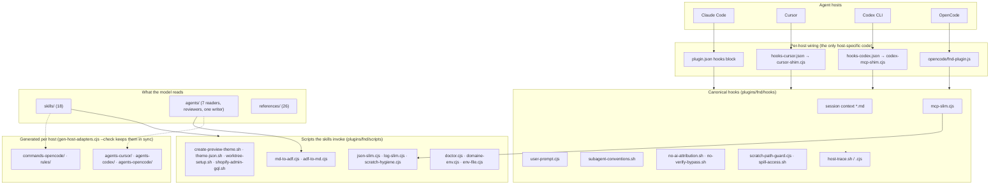
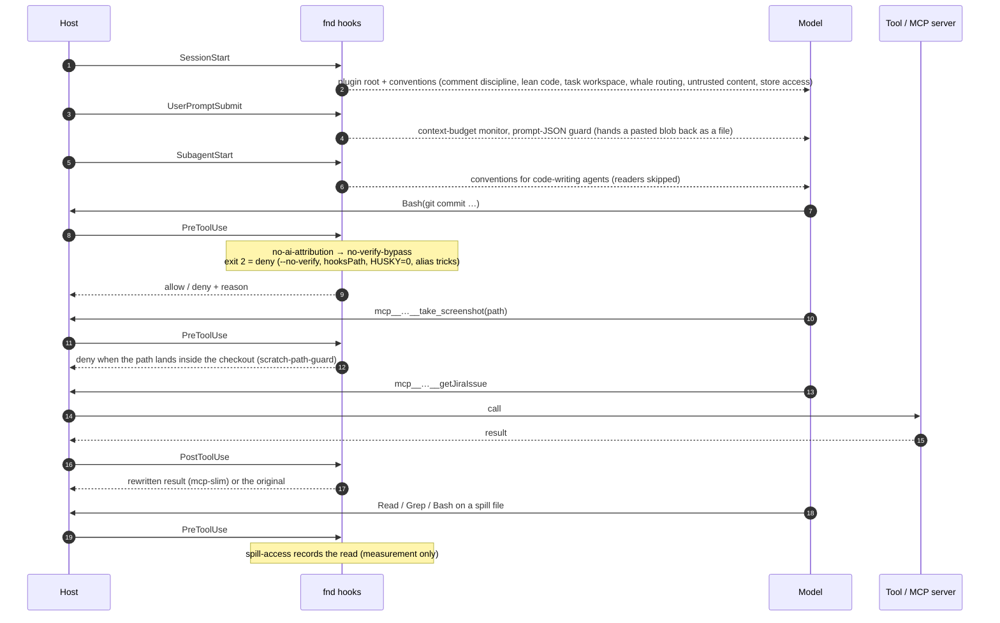
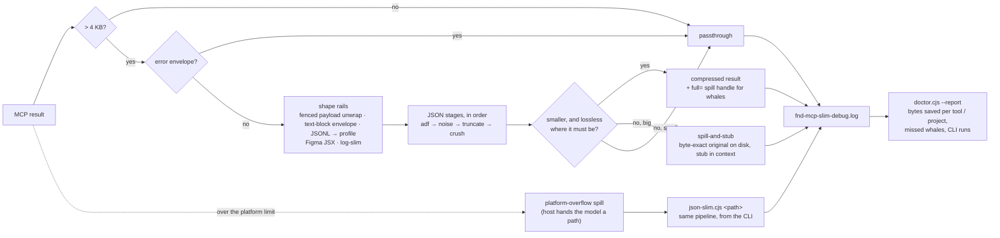
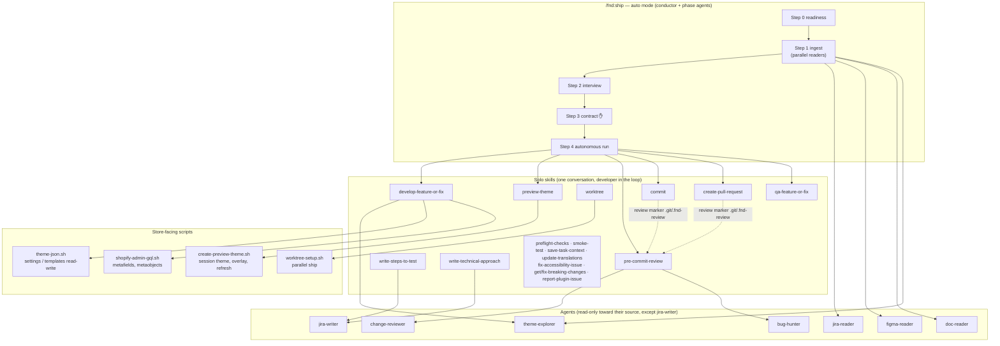
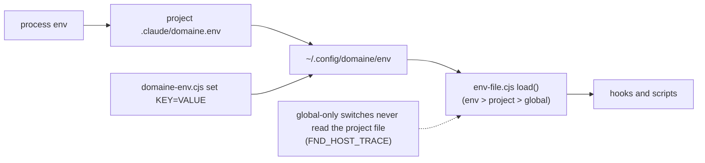
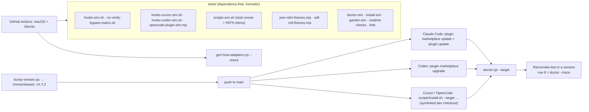

# fnd plugin — architecture

One repository, four agent hosts, one set of canonical behaviour. Everything the model reads
(skills, agents, references, hook context) and everything that runs (hooks, scripts) lives under
`plugins/fnd/`; each host gets a thin adapter that translates its own hook protocol into the
canonical one. The diagrams render natively on GitHub.

## 1. Layers

The rule behind the picture: a behaviour is implemented once, in `canon` or `scripts`, and every
host reaches it through its adapter. The adapters translate payload keys and response shapes and
never re-implement a decision; `tests/hooks-cursor-sim.sh`, `tests/hooks-codex-sim.sh` and
`tests/opencode-plugin-sim.mjs` replay the same fixtures through each dialect.

## 2. A session, hook by hook

Every hook appends one metadata line to `fnd-host-trace.log` when `FND_HOST_TRACE=1`;
`doctor.cjs --trace` renders it as an event/hook × host matrix — the proof the hooks fired on
a host, from disk rather than from the model's own report.

## 3. MCP result compression (mcp-slim + json-slim)

Two guards sit around the pipeline: a no-gain memo refuses to re-run the same file for two hours
when the first run gained nothing, and the whale-guide is a one-shot instruction layer that tells
the model how to read a spill (the `mcp-whale.md` session context is the trigger, json-slim's own
stdout is the recipe). Spill files carry a TTL and are swept by the hook itself.

Per host, the result rewrite is a capability of the host, not of the plugin:

| Host | Session context | Prompt hook | Subagent conventions | Shell guards | Screenshot guard | Spill access | MCP result rewrite |
| --- | --- | --- | --- | --- | --- | --- | --- |
| Claude Code | hook | yes | yes | yes | yes | yes | **yes** — compressed or stubbed in place |
| OpenCode | adapter (store projects) | yes | no event on this host | yes | yes | yes | **yes** — the adapter rewrites `output.content` |
| Codex CLI | hook | yes | yes | yes | yes | yes | stub only — the shim forwards the spill handle as `additionalContext`; a compressed copy would grow the context |
| Cursor | rules + shim | shim | shim (unverified) | shim | shim | shell reads only | **no** — `afterMCPExecution` has no response schema; the shim only logs that it fired |

## 4. Skills, agents and the ship pipeline

The review flow is one mechanism shared by `pre-commit-review`, `commit` and
`create-pull-request`: a marker in `.git/.fnd-review` records which diff was reviewed, so the
commit and PR skills re-run the reviewers only when the diff drifted
(`plugins/fnd/references/review-flow.md`). Every ticket-tied piece of work keeps its memory in
`.claude/tasks/<work-id>/` — reader outputs, approved plans, decisions — so a new session or a
compaction loses nothing (`plugins/fnd/references/task-workspace.md`).

## 5. Bundled MCP servers

`plugins/fnd/mcp.json` ships six servers: `atlassian` (Jira and Confluence), `figma-dev-mode`,
`notion-mcp`, `shopify-dev-mcp`, `chrome-devtools-mcp`, `playwright`. Jira and Confluence
rich text is written as ADF through `md-to-adf.cjs` and read back through `adf-to-md.cjs`
(round-trip fixtures in `tests/adf-md-fixtures.mjs`). Hosts with a tool cap get
`plugins/fnd/mcp.pruned.json`.

## 6. Configuration and switches

Every `FND_*` switch is listed in README → Environment switches; each is read through the
same loader, and the hooks pre-gate on the cheap ones in the wiring so a disabled feature spawns
no process.

## 7. Tests, release, install

The plugin installs from the GitHub remote, so an unpushed commit is invisible to every host.
`doctor.cjs` says whether a host will load the checkout; `smoke-test` proves what a script cannot
reach from inside a session; `doctor.cjs --trace` and `--report` read the two logs back.
