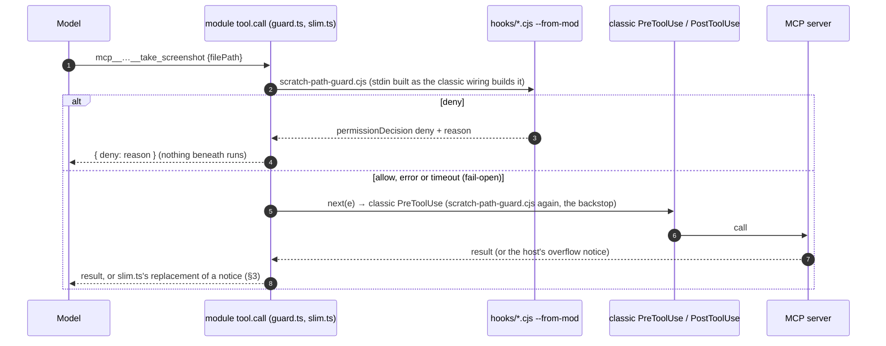
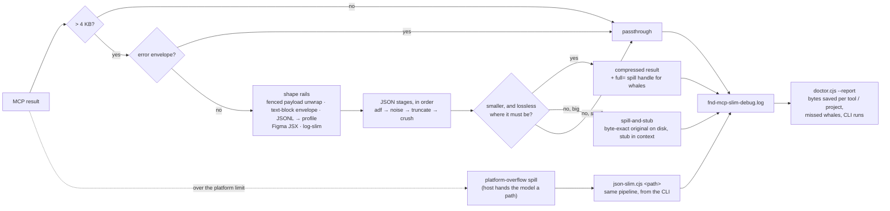
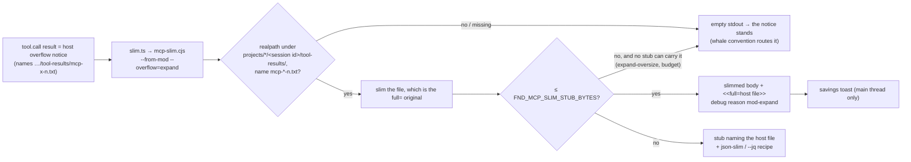
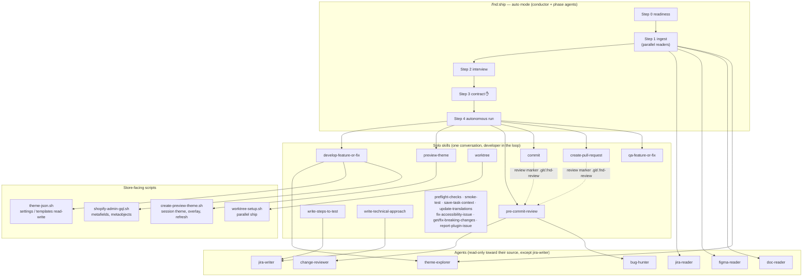
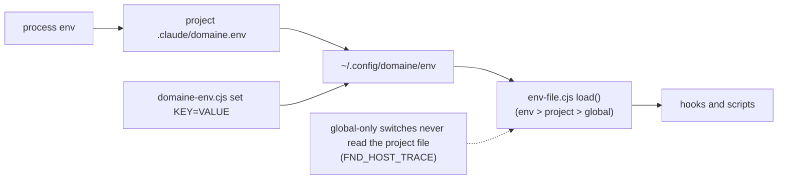
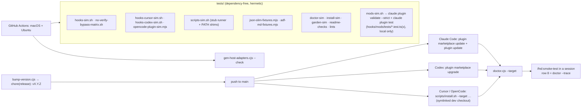

# fnd plugin — architecture

One repository, four agent hosts, one set of canonical behaviour. Everything the model reads
(skills, agents, references, hook context) and everything that runs (hooks, scripts) lives under
`plugins/fnd/`; each host gets a thin adapter that translates its own hook protocol into the
canonical one. The diagrams render natively on GitHub.

## 1. Layers


```mermaid
flowchart TB
  subgraph hosts["Agent hosts"]
    CC["Claude Code"]
    CU["Cursor"]
    CX["Codex CLI"]
    OC["OpenCode"]
  end

  subgraph wiring["Per-host wiring (the only host-specific code)"]
    W1["plugin.json hooks block"]
    W2["hooks-cursor.json → cursor-shim.cjs"]
    W3["hooks-codex.json → codex-mcp-shim.cjs"]
    W4["opencode/fnd-plugin.js"]
  end

  subgraph canon["Canonical hooks (plugins/fnd/hooks)"]
    H1["session-start.sh → session context *.md"]
    H2["user-prompt.cjs · prompt-json-guard.cjs"]
    H3["subagent-conventions.sh"]
    H4["no-ai-attribution.sh · no-verify-bypass.sh"]
    H5["scratch-path-guard.cjs · spill-access.sh"]
    H6["mcp-slim.cjs"]
    H7["host-trace.sh / .cjs"]
    H8["scripts/project-profile.sh (checkout profile probe)"]
  end

  subgraph mods["Claude Code hooks module (hooks/hooks.json → hooks/mods/register.tsx)"]
    M1["core/ — usage.ts · band.tsx · progress.tsx<br/>(status band, progress pane)"]
    M2["fnd/ — guard.ts · slim.ts · prompt-slim.ts<br/>(node-hook.ts adapter)"]
  end

  subgraph model["What the model reads"]
    S["skills/ (18)"]
    A["agents/ (7 readers, reviewers, one writer)"]
    R["references/ (29)"]
  end

  subgraph scripts["Scripts the skills invoke (plugins/fnd/scripts)"]
    P1["create-preview-theme.sh · theme-json.sh · worktree-setup.sh · shopify-admin-gql.sh"]
    P2["json-slim.cjs · log-slim.cjs · scratch-hygiene.cjs"]
    P3["md-to-adf.cjs · adf-to-md.cjs · jira-attachments.sh<br/>figma-rest.sh · figma-node-slim.cjs"]
    P4["doctor.cjs · domaine-env.cjs · env-file.cjs"]
  end

  subgraph gen["Generated per host (gen-host-adapters.cjs --check keeps them in sync)"]
    G1["agents-cursor/ · agents-codex/ · agents-opencode/"]
    G2["commands-opencode/ · rules/"]
  end

  CC --> W1 --> canon
  CC --> mods
  M2 -. "spawns node (--from-mod)" .-> H5
  M2 -. "spawns node (--from-mod)" .-> H6
  M2 -. "spawns node (--from-mod)" .-> H2
  CU --> W2 --> canon
  CX --> W3 --> canon
  OC --> W4 --> canon
  canon --> H7
  H1 --> H8
  H3 --> H8
  S --> scripts
  A --> P3
  H6 --> P2
  A -.-> G1
  S -.-> G2
```

The rule behind the picture: a behaviour is implemented once, in `canon` or `scripts`, and every
host reaches it through its adapter. The adapters translate payload keys and response shapes and
never re-implement a decision; `tests/hooks-cursor-sim.sh`, `tests/hooks-codex-sim.sh` and
`tests/opencode-plugin-sim.mjs` replay the same fixtures through each dialect.

Claude Code also loads a **hooks module**, function hooks that run inside the session engine
beside the classic command hooks (§8). It is Claude Code's alone. The Cursor and Codex manifests
name their own hook files (`hooks/hooks-cursor.json`, `hooks/hooks-codex.json`) and never
`hooks/hooks.json`. OpenCode loads only `opencode/fnd-plugin.js`. The module keeps the same rule
as the adapters: its guard, slim and prompt-slim halves spawn the canonical
`scratch-path-guard.cjs`, `mcp-slim.cjs` and `prompt-json-guard.cjs` and never re-implement their
decisions.

## 2. A session, hook by hook

```mermaid
sequenceDiagram
  autonumber
  participant Host
  participant Hooks as fnd hooks
  participant Model
  participant Tool as Tool / MCP server

  Host->>Hooks: SessionStart
  Note over Hooks: plugin.json and hooks-codex.json both spawn hooks/session-start.sh
  Hooks-->>Model: plugin root + project profile + conventions (comment discipline, LiquidDoc-and-core addendum in a foundation checkout, lean code, task workspace, whale routing, untrusted content, plugin feedback, store access)
  Host->>Hooks: UserPromptSubmit
  Hooks-->>Model: context-budget monitor, prompt-JSON guard (hands a pasted blob back as a file; on Claude Code the module first rewrites the blob in place, §8)
  Host->>Hooks: SubagentStart
  Hooks-->>Model: conventions for code-writing agents (readers skipped)
  Model->>Host: Bash(git commit …)
  Host->>Hooks: PreToolUse
  Note over Hooks: no-ai-attribution → no-verify-bypass<br/>exit 2 = deny (--no-verify, hooksPath, HUSKY=0, alias tricks)
  Hooks-->>Host: allow / deny + reason
  Model->>Host: mcp__…__take_screenshot / take_snapshot / … (path)
  Host->>Hooks: PreToolUse
  Hooks-->>Host: deny a path outside the project, or inside it outside .claude/ (scratch-path-guard)
  Model->>Host: mcp__…__getJiraIssue
  Host->>Tool: call
  Tool-->>Host: result
  Host->>Hooks: PostToolUse
  Hooks-->>Host: rewritten result (mcp-slim) or the original
  Model->>Host: Read / Grep / Bash on a spill file
  Host->>Hooks: PreToolUse
  Note over Hooks: spill-access records the read (measurement only)
```

On Claude Code the module wraps every tool call. Its `tool.call` hooks run first, and the classic
`PreToolUse` command hooks fire **inside** that call, beneath every plugin's `tool.call` hook:


```mermaid
sequenceDiagram
  autonumber
  participant Model
  participant Mod as module tool.call (guard.ts, slim.ts)
  participant Node as hooks/*.cjs --from-mod
  participant Classic as classic PreToolUse / PostToolUse
  participant Tool as MCP server

  Model->>Mod: mcp__…__take_screenshot {filePath}
  Mod->>Node: scratch-path-guard.cjs (stdin built as the classic wiring builds it)
  alt deny
    Node-->>Mod: permissionDecision deny + reason
    Mod-->>Model: { deny: reason } (nothing beneath runs)
  else allow, error or timeout (fail-open)
    Mod->>Classic: next(e) → classic PreToolUse (scratch-path-guard.cjs again, the backstop)
    Classic->>Tool: call
    Tool-->>Mod: result (or the host's overflow notice)
    Mod-->>Model: result, or slim.ts's replacement of a notice (§3)
  end
```

Every hook appends one metadata line to `fnd-host-trace.log` when `FND_HOST_TRACE=1`;
`doctor.cjs --trace` renders it as an event/hook × host matrix — the proof the hooks fired on
a host, from disk rather than from the model's own report. A run the module spawned is filed
under event `mod` (and `from:"mod"` in the compressor's debug log), so it never counts as proof that
a classic wiring fired.

## 3. MCP result compression (mcp-slim + json-slim)


```mermaid
flowchart LR
  R["MCP result"] --> G{"> 4 KB?"}
  G -- no --> PT["passthrough"]
  G -- yes --> ERR{"error envelope?"}
  ERR -- yes --> PT
  ERR -- no --> SHAPE["shape rails<br/>fenced payload unwrap · text-block envelope · JSONL → profile<br/>Figma JSX · log-slim"]
  SHAPE --> STAGES["JSON stages, in order<br/>adf → noise → truncate → crush"]
  STAGES --> GAIN{"smaller, and lossless<br/>where it must be?"}
  GAIN -- yes --> C["compressed result<br/>+ full= spill handle for whales"]
  GAIN -- no, big --> STUB["spill-and-stub<br/>byte-exact original on disk, stub in context"]
  GAIN -- no, small --> PT
  R -. "over the platform limit" .-> OVF["platform-overflow spill<br/>(host hands the model a path)"]
  OVF --> CLI["json-slim.cjs &lt;path&gt;<br/>same pipeline, from the CLI"]
  C & STUB & PT & CLI --> LOG["fnd-mcp-slim-debug.log"]
  LOG --> REP["doctor.cjs --report<br/>bytes saved per tool / project,<br/>missed whales, CLI runs"]
```

Two guards sit around the pipeline: a no-gain memo refuses to re-run the same file for two hours
when the first run gained nothing, and the whale-guide is a one-shot instruction layer that tells
the model how to read a spill (the `mcp-whale.md` session context is the trigger, json-slim's own
stdout is the recipe). Spill files carry a TTL and are swept by the hook itself.

Per host, the result rewrite is a capability of the host, not of the plugin:

| Host | Session context | Prompt hook | Subagent conventions | Shell guards | Screenshot guard | Spill access | MCP result rewrite | Hooks module |
| --- | --- | --- | --- | --- | --- | --- | --- | --- |
| Claude Code | hook | yes | yes | yes | yes | yes | **yes** — compressed or stubbed in place | **yes** — band, pane, guard on the call, over-limit expansion |
| OpenCode | adapter (every project) | yes | no event on this host | yes | **no** — `tool.execute.before` reaches only the bash tool | yes | **yes** — the adapter rewrites `output.content` | no |
| Codex CLI | hook | yes | yes | yes | yes | yes | **yes** — compress **and** stub, returned as a PostToolUse `block` reason (capped 10 KB); over-cap ⇒ stub, a non-text block ⇒ `additionalContext` | no |
| Cursor | rules + shim | shim | shim (unverified) | shim | shim | shell reads only | **no** — `afterMCPExecution` has no response schema; the shim only logs that it fired | no |

On Claude Code the module closes the one gap in the picture above: a result over the platform
limit, which the classic hook only ever sees as the host's overflow notice.


```mermaid
flowchart LR
  N["tool.call result = host overflow notice<br/>(names …/tool-results/mcp-x-n.txt)"] --> M["slim.ts → mcp-slim.cjs<br/>--from-mod --overflow=expand"]
  M --> B{"realpath under<br/>projects/*/&lt;session id&gt;/tool-results/,<br/>name mcp-*-n.txt?"}
  B -- no / missing --> KEEP["empty stdout → the notice stands<br/>(whale convention routes it)"]
  B -- yes --> SL["slim the file, which is the full= original"]
  SL --> FIT{"≤ FND_MCP_SLIM_STUB_BYTES?"}
  FIT -- yes --> BODY["slimmed body + &lt;&lt;full=host file&gt;&gt;<br/>debug reason mod-expand"]
  FIT -- no --> HB["stub naming the host file<br/>+ json-slim / --jq recipe"]
  FIT -->|"no, and no stub can carry it<br/>(expand-oversize, budget)"| KEEP
  BODY --> T["savings toast (main thread only)"]
```

**Idempotence.** `mcp-slim.cjs` recognises its own emission, a stub or its stats line beside a
`<<full=` handle, and passes it through with reason `already-slim` on every host. A forged mark
on a body larger than any emission does not count. So a result is never slimmed twice, whichever
order the module and the classic PostToolUse hook run in. `json-slim --report` pairs a
`platform-overflow` event with a later compressed `mod-expand` event on the same file as a recovery.

## 4. Skills, agents and the ship pipeline


```mermaid
flowchart TB
  subgraph solo["Solo skills (one conversation, developer in the loop)"]
    D["develop-feature-or-fix"]
    PV["preview-theme"]
    WT["worktree"]
    CM["commit"]
    PR["create-pull-request"]
    PCR["pre-commit-review"]
    QA["qa-feature-or-fix"]
    STT["write-steps-to-test"]
    TA["write-technical-approach"]
    MISC["preflight-checks · smoke-test · save-task-context · update-translations<br/>fix-accessibility-issue · get/fix-breaking-changes · report-plugin-issue"]
  end

  subgraph ship["/fnd:ship — auto mode (conductor + phase agents)"]
    S0["Step 0 readiness"] --> S1["Step 1 ingest<br/>(parallel readers)"] --> S2["Step 2 interview"] --> S3["Step 3 contract ✋"] --> S4["Step 4 autonomous run"]
  end

  subgraph agents["Agents (read-only toward their source, except jira-writer)"]
    JR["jira-reader"]
    FR["figma-reader"]
    DR["doc-reader"]
    TE["theme-explorer"]
    CR["change-reviewer"]
    BH["bug-hunter"]
    JW["jira-writer"]
  end

  subgraph store["Store-facing scripts"]
    CPT["create-preview-theme.sh<br/>session theme, overlay, refresh"]
    TJ["theme-json.sh<br/>settings / templates read-write"]
    GQL["shopify-admin-gql.sh<br/>metafields, metaobjects"]
    WS["worktree-setup.sh<br/>parallel ship"]
  end

  S1 --> JR & FR & DR & TE
  S4 --> D & PV & PCR & CM & PR & QA
  PCR --> CR & BH
  STT & TA --> JW
  D --> TE
  PV --> CPT
  D --> TJ & GQL
  WT --> WS
  CM & PR -. "review marker .git/.fnd-review" .-> PCR
```

The review flow is one mechanism shared by `pre-commit-review`, `commit` and
`create-pull-request`: a marker in `.git/.fnd-review` records which diff was reviewed, so the
commit and PR skills re-run the reviewers only when the diff drifted
(`plugins/fnd/references/review-flow.md`). Every ticket-tied piece of work keeps its memory in
`.claude/tasks/<work-id>/` — reader outputs, approved plans, decisions — so a new session or a
compaction loses nothing (`plugins/fnd/references/task-workspace.md`).

## 5. Bundled MCP servers

`plugins/fnd/mcp.json` ships six servers: `atlassian` (Jira and Confluence), `figma-dev-mode`,
`notion-mcp`, `shopify-dev-mcp`, `chrome-devtools-mcp`, `playwright`. Jira and Confluence
rich text is written as ADF through `md-to-adf.cjs` and read back through `adf-to-md.cjs`
(round-trip fixtures in `tests/adf-md-fixtures.mjs`). Hosts with a tool cap get
`plugins/fnd/mcp.pruned.json`.

## 6. Configuration and switches


```mermaid
flowchart LR
  ENV["process env"] --> P["project .claude/domaine.env"] --> GL["~/.config/domaine/env"]
  GL --> READ["env-file.cjs load()<br/>(env > project > global)"]
  READ --> HOOKS["hooks and scripts"]
  DE["domaine-env.cjs set KEY=VALUE"] --> GL
  NOTE["global-only switches never read the project file<br/>(FND_HOST_TRACE)"] -.-> READ
```

Every `FND_*` switch is listed in README → Environment switches; each is read through the same
loader, or through a bash reader that mirrors it by hand (`project-profile.sh`,
`_shopify-common.sh`, `spill-access.sh`) — `tests/layout-assertions.sh` holds the copies equal.
The hooks pre-gate on the cheap ones in the wiring so a disabled feature spawns no process.

The hooks module sits outside that loader. It reads `FND_SCRATCH_GUARD`, `FND_MCP_SLIM` and
`FND_MCP_SLIM_STUB_BYTES` from the session's own environment (the shell and `settings.json` →
`env`). The env files reach only the `.cjs` it spawns, which re-checks its switch itself, so a
switch set in a file still holds, one spawn later. The module's own settings are `plugin.json` →
`userConfig`: `statusBand` (draw the band) and `cacheTtl` (`auto` / `5m` / `1h`). Claude Code
documents them as `/config` rows (where they appear is still a live check), stores them under `pluginConfigs` in `~/.claude/settings.json` and
hands them to `register(on, options)`. A change reloads the module.

## 7. Tests, release, install


```mermaid
flowchart LR
  subgraph tests["tests/ (dependency-free, hermetic)"]
    T1["hooks-sim.sh · no-verify-bypass-matrix.sh"]
    T2["hooks-cursor-sim.sh · hooks-codex-sim.sh · opencode-plugin-sim.mjs"]
    T3["scripts-sim.sh (stub runner + PATH shims)"]
    T4["json-slim-fixtures.mjs · adf-md-fixtures.mjs"]
    T5["doctor-sim · install-sim · garden-sim · readme-checks · lints"]
    T6["mods-sim.sh → claude plugin validate --strict + claude plugin test<br/>(hooks/mods/tests/*.test.ts(x), local only)"]
  end
  CI["GitHub Actions: macOS + Ubuntu"] --> tests
  CI --> GEN["gen-host-adapters.cjs --check"]
  REL["bump-version.cjs → chore(release): vX.Y.Z"] --> PUSH["push to main"]
  PUSH --> I1["Claude Code: plugin marketplace update + plugin update"]
  PUSH --> I2["Codex: plugin marketplace upgrade"]
  PUSH --> I3["Cursor / OpenCode: scripts/install.sh --target …<br/>(symlinked dev checkout)"]
  I1 & I2 & I3 --> DOC["doctor.cjs --target <host>"]
  DOC --> SMOKE["/fnd:smoke-test in a session<br/>row 8 = doctor --trace"]
```

The plugin installs from the GitHub remote, so an unpushed commit is invisible to every host.
`doctor.cjs` says whether a host will load the checkout; `smoke-test` proves what a script cannot
reach from inside a session; `doctor.cjs --trace` and `--report` read the two logs back.

The hooks module is tested by the engine's own kit. Each `hooks/mods/tests/*.test.ts(x)` mounts the
band and pane on the terminal and desktop surfaces, raises the events, and stubs every engine op it
touches. `tests/mods-sim.sh` wraps `claude plugin validate --strict` and `claude plugin test`. CI has
no `claude` binary, so the suite prints SKIP there; run it locally before a release (the README
release checks list it). The Node
halves the module spawns stay covered by `tests/hooks-sim.sh` (guard D cases, mcp-slim M-exp, M-idem and
M-req cases, prompt-json-guard `--from-mod` PM cases) and the three host sims.

## 8. Mods

The module is one ES module tree, compiled by the engine. It imports only from `claude-code`, its
own files and `plugins/fnd/types/index.d.ts`, with no npm, `require`, `import()` or Node globals.

```
hooks/hooks.json            { "modules": ["./mods/register.tsx"] }
hooks/mods/register.tsx     register(on, options) → registerMarker, registerUsage, registerBand, registerProgress, registerLog, registerGuard, registerSlim, registerPromptSlim
hooks/mods/core/            usage.ts (atoms + 30 s tick) · band.tsx (AbovePrompt) · progress.tsx (resolver, /fnd-progress, Pane)
                            log.tsx (/fnd-log, Pane: the event log)
                            lib.ts · workid.ts · progress-parse.ts · events.ts (pure)
hooks/mods/fnd/             guard.ts (tool.describe note + tool.call deny) · slim.ts (overflow expansion + toast)
                            prompt-slim.ts (prompt.submit: pasted JSON rewritten in place + toast)
                            node-hook.ts (pure: builds the node call, reads its answer)
types/index.d.ts            the $.state contract: every key the module reads or writes
```

**Layout rule.** `claude plugin validate --strict` enforces these:
- **`$`-code never crosses a file boundary.** The validator follows `$` only into functions
  declared in the same file. Passing `$` to an imported helper, or an atom imported from another
  file, fails.
- **Each feature file declares the atoms it touches** with literal `{ plugin: 'fnd', key }` refs.
  The same literal in two files shares the value, and `types/index.d.ts` is the one list of
  allowed keys.
- **Shared code is pure** (`lib.ts`, `workid.ts`, `progress-parse.ts`, `events.ts`, `node-hook.ts`) and is
  imported freely, by tests too. A `$` helper several files need (the event log's `logEvent`) is
  copied as a top-level function into each writer file; the shared parts (`pushEvent`, `bare`,
  `toolName`) are pure.
- **Render paths only read atoms.** Writers update them from events, timers and presses. The
  band learns the pane is open from the `paneShown` atom, never from a pane listing while drawing.
  The log pane draws the `events` atom only; usage, progress, guard, slim and prompt-slim append to it.
- **One unmatched hook per event per plugin.** A second `on('session.start', …)` without a
  matcher fails validation and module load, so `usage.ts` and `guard.ts` register theirs with
  match-all matchers. All of a plugin's hooks on one event act as one hook: one that throws skips
  the rest. That is why the guard also latches its root on the first tool call. prompt-slim
  matches on `origin.kind` because progress holds the one unmatched `prompt.submit` hook.

**Classic hooks on Claude Code, with the module loaded:**

| Classic hook | With the module | Mechanism |
|---|---|---|
| `scratch-path-guard.cjs` (PreToolUse, 5 tools) | keeps running as the backstop | The module's deny pre-empts it for that call (classic PreToolUse fires beneath `tool.call`). A skipped module hook fails open, and the classic guard still guards. |
| `mcp-slim.cjs` (PostToolUse `mcp__.*`) | keeps running | `already-slim` idempotence makes double processing impossible. The session-bound marker that would let it drop its own notice when the module toasts (`FND_MOD_SESSION`) is not built: it waits for two live checks (where classic PostToolUse runs relative to `tool.call`; whether command hooks inherit an env the module sets). Until then the figure can show twice. |
| `compression-notice.cjs` systemMessage | shown beside the module's toast | Replaced by the toast once the marker exists |
| `prompt-json-guard.cjs` (UserPromptSubmit half) | keeps running beneath the rewrite | It runs inside the module's `next` and sees the rewritten prompt, which `--from-mod` has already re-checked against the classic predicate, so it passes. Prompts the module skips (slash and `!` commands; peer, task-notification and plugin origins) and any module failure still meet the block. |
| `user-prompt.cjs` context monitor | silent while the session marker is fresh | The module's `fnd/marker.ts` (registered first) rewrites `<tmpdir>/fnd-mod-session-<sid>` (sid stripped to `[A-Za-z0-9_.-]`) before `next` on every prompt, bounded at 500 ms; `hooks/mod-session.cjs` counts it only under 60 s old, so a resume without the module brings the monitor back. The band shows ctx and model; the warn-level `additionalContext` is dropped with it. The mod cannot delete files, so old markers stay in tmpdir. |
| session-start, subagent conventions, git guards, spill-access, reader-compression | unchanged | Out of the module's scope |
| Cursor / Codex / OpenCode | unchanged except `already-slim`, the `mcp-slim.cjs` require guard, one whale-convention sentence and the untrusted-content clause on prompt spills | Every other module-specific Node behaviour sits behind an argv flag (`--from-mod`, `--overflow=expand`) only the module passes. `hooks/mcp-whale.md` reaches every host (Codex via `session-start.sh`, OpenCode via the adapter's statics, Cursor via `rules/fnd-mcp-whale.mdc`), so its "On Claude Code an over-limit result often arrives already slimmed or stubbed" line is read there too, guarded as Claude-Code-only. `mcp-slim.cjs` runs its stdin entry only as `require.main`, so every host's spawn behaves as before, and `hooks/untrusted-content.md` names `.claude/tasks/<work-id>/tmp/` and `.claude/fnd-tmp/prompt-json/` as real homes of `fnd-prompt-json-*` handles on every host |

Rejected: answering `classic.PostToolUse` for `mcp__` tools without calling `next`. That would
silence every user, project and other-plugin PostToolUse hook on MCP tools, and the spill TTL sweep
with them.

**Split readiness** (the core/fnd plugin split stays parked):
- `hooks/mods/core/` (band, pane, usage, resolver) can move to a future core plugin as one folder.
- `hooks/mods/fnd/` (guard, slim, prompt-slim, Node adapter) stays in fnd.
- Imports run one way only: `register.tsx → core` and `register.tsx → fnd`. `core` never imports
  `fnd`. The one exception is `fnd → core/events.ts` (pure `pushEvent`, `bare`, `toolName`) for the event log's guard,
  slim and prompt-slim lines. At the split those files lose write access to core's `events` key
  (a plugin writes only its own state), so they would publish through an fnd key the log pane reads.
- Only `core` draws `AbovePrompt`, which has one instance per chain. A future fnd-only segment
  (theme, store) would publish through its own state key, which any plugin may read.
- At the split, the `'fnd'` literal in `core/**` becomes `'fnd-core'`. Whether the shared contract
  moves to `dependencies` is decided then.
