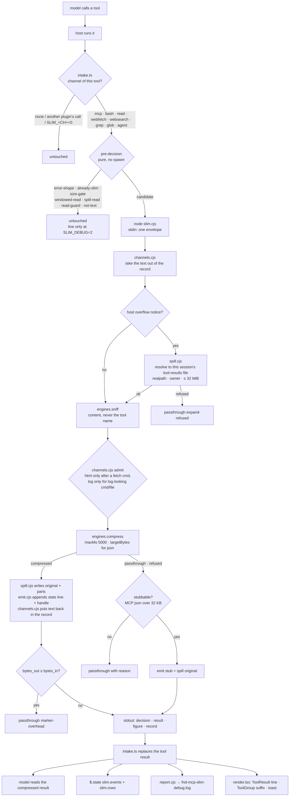

# slim — architecture

What runs where, what it writes, and why each piece sits where it does. The README says what slim
does for the person using it; this file is for whoever changes it. Sizes and names are the ones in
the code on the date at the bottom; the code wins when they drift.

## 1. The three layers

```
┌─────────────────────────────────────────────────────────────────────────────────────────────┐
│  CLAUDE CODE ENGINE  (the host: runs tools, draws the UI, holds $.state, loads mods)         │
└───────────────┬──────────────────────────────────────────────────────────┬──────────────────┘
                │ events: tool.call, tool.describe, prompt.attachment,     │ ui.render ToolResult /
                │ prompt.submit, session.start, ui.render                  │ ToolGroup; $.state
                ▼                                                          ▼
┌─────────────────────────────────────────────────────────────────────────────────────────────┐
│  LAYER 3 · MODULE   plugins/slim/hooks/mods/*.ts(x)   — Claude Code function hooks           │
│                                                                                              │
│  register.ts ──┬── intake.ts     every tool result: gate → spawn core → replace result,       │
│                │                 write slim.events + slim.rows, toast (MCP, main loop only);  │
│                │                 an @-mentioned data file the same way (once-per-content line) │
│                ├── guard.ts      unwindowed Read of a big spill → deny + pointer; access lines │
│                ├── prompt.ts     typed / bridge prompt → --prompt → data spans rewritten in    │
│                │                 place; toast + event                                         │
│                ├── lookup.ts     mcp__slim__lookup: WebFetch | Read+distill | Bash+distill    │
│                │                 → one haiku question → ≤ 1 KB answer; event + report line    │
│                ├── view.ts       mcp__slim__view: Read check | Bash → --view → compact text;  │
│                │                 out through the Write tool; event + report line              │
│                ├── describe.ts   one sentence on Bash/WebFetch descriptions pointing at lookup │
│                ├── info.ts       slim.info snapshot at session.start (version, channels);      │
│                │                 the start line `slim <version>` into slim.events             │
│                ├── eventlog.ts   slim's own state.set hook on slim.events → slim.jsonl on disk │
│                └── render.tsx    dim line under a compressed tool row; ToolGroup fold suffix   │
│  channels.ts (pure: tool → channel, gate, pre-decisions)   node-hook.ts (pure: argv/parse)    │
│  events.ts (pure: event texts, pct, sizes)                 types/index.d.ts ($.state contract)│
└───────────────────────────────┬──────────────────────────────────────────────────────────────┘
                                │ $.process.run('node slim.cjs', stdin = one JSON envelope)
                                ▼
┌─────────────────────────────────────────────────────────────────────────────────────────────┐
│  LAYER 2 · DELIVERY   plugins/slim/scripts/slim.cjs + scripts/delivery/*.cjs                 │
│  the only code that knows Claude Code's tool shapes, files and switches                      │
│                                                                                              │
│  slim.cjs        dispatcher: hook mode, --distill, --view, --prompt, --prompt-drop,          │
│                  --access, --record, --error, --report                                       │
│  view.cjs        the view tool's core: jq narrowing → engine | media; out target, cache mark │
│  prompt.cjs      the prompt channel: spans → engines → in-place text; durable spills under   │
│                  <project root>/.claude/slim/prompt/ (main checkout's for a worktree)        │
│  channels.cjs    per-channel table: gate, admitted engines, take text out / put text back    │
│  emit.cjs        stats line, <<full=…>> handle, <<slim stub>>, Read note, lookup hint,       │
│                  and the already-slim detector (slim's marks + the legacy fnd- ones, §5)     │
│  spill.cjs       spill files (fnd-mcp-slim-*, fnd-crush-*, fnd-jsx-ids-*), TTL sweep,        │
│                  which existing files a handle or a host notice may name                     │
│  env.cjs         SLIM_* switches, from the process env only                                  │
│  report.cjs      one metadata line per invocation → fnd-mcp-slim-debug.log; --report         │
│  media.cjs       runs a media plan: ffprobe + ffmpeg on PATH, else sips (images); outputs    │
│                  beside the input, only at the path the caller's Write check allowed         │
└───────────────────────────────┬──────────────────────────────────────────────────────────────┘
                                │ compress({ data, hint }, options) / sniff(input)   (plain require)
                                ▼
┌─────────────────────────────────────────────────────────────────────────────────────────────┐
│  LAYER 1 · ENGINES   plugins/slim/scripts/engines/*.cjs   — pure library, CONTRACT.md v1     │
│  no env, no fs, no stdin, no child_process, no os, no timers; only 'crypto' + siblings       │
│                                                                                              │
│  index.cjs → sniff.cjs ─┬─ json.cjs   (envelope unwrap · noise · ADF→md · smart crush · trim)│
│                         ├─ log.cjs    (dedupe · levels · stack traces kept · ×N survivors)   │
│                         ├─ html.cjs   (title/meta · visible text as md · links · script src) │
│                         ├─ figma.cjs  (design-context JSX compactor, id map as a part)       │
│                         ├─ figma-nodes.cjs (REST nodes response → markdown build tree, folds)│
│                         ├─ adf.cjs    (Atlassian document → markdown)                        │
│                         └─ text-window.cjs (head + tail window, hidden-lines count)          │
│  media.cjs  (beside compress(): kindOf · plan resize / frames from probe facts · figure)     │
│  jq.cjs     (beside compress(): narrow a JSON document by a small jq subset, or refuse)      │
│  spans.cjs  (beside compress(): the JSON / JSONL / log / HTML spans inside a mixed text)    │
│  returns { v, engine, decision, text, stats, spill?, parts?, window?, meta?, warnings }      │
│  never writes: spill payloads come BACK to the caller, who decides where they go             │
└─────────────────────────────────────────────────────────────────────────────────────────────┘
```

**Why three layers.** The engines are the asset that outlives this plugin: a proxy for another
harness, a microservice, a CLI reuse them unchanged, so they know nothing about tools, files or
switches (`tests/layout-assertions.sh` greps them for `process.env`, `fs`, `stdin`,
`child_process`, `os`). Delivery is where Claude Code's rules live: a hook's result must keep the
built-in tool's output shape, the host's overflow files must be resolved safely, and the switches,
spill files and report log need a filesystem and a process. The module is as thin as
the engine API allows: it hooks events, measures bytes, spawns, and draws. Moving logic up into the
module would make it untestable outside `claude plugin test`; moving it down into the engines would
make them host-specific.

## 2. One tool result, start to finish



The module **lets the tool run first and never races `next`**: a hook that returns while `next` is
pending aborts the tool beneath it. Everything before the spawn is a pure byte or shape check, so
a result under its gate costs nothing. Anything the module cannot read back (failed spawn,
non-zero exit, bad JSON) leaves the original result untouched and writes an error line.

### Gates (bytes of the text slim would read)

| channel | gate | window if plain text | egress cap (json still over it → stub) |
|---|---|---|---|
| mcp | 4,096 | — | stub threshold 32,768 |
| bash | 4,096 | 4,096 for a host-persisted output, else SLIM_PLAIN_BYTES | host inline limit − 2,048, at most 32,768; an answer at or past the host limit (chars, stdout + stderr) → stub, or pass through |
| read | 32,768 | — | 65,536 |
| webfetch | 16,384 | 12,288 | 32,768 |
| websearch | SLIM_PLAIN_BYTES | 12,288 | 32,768 |
| grep / glob | 16,384 | 8,192 | 16,384 |
| agent | SLIM_PLAIN_BYTES | 12,288 | 32,768 |
| attachment (@-mentioned file) | 32,768 (the framed text); json, jsonl and log only | — | 65,536 |
| prompt | 10,240 the prompt, 8,192 a span | — | JSON inline under 8,192, log / HTML under 100 KB, else head + handle |

The module's `GATES` literal and `delivery/channels.cjs` hold the same numbers; a fixture test pins
them equal, so the pure pre-decision in the module and the core never disagree.

### Why the guard rails

- **Read is narrowed** to whole-file reads of `.log/.jsonl/.ndjson` over 32 KB and of `.json` the
  host itself truncated by its token cap, and never to source JSON (`config/`, `templates/`,
  `locales/`, `package.json`, …). After a Read the model often Edits; Edit matches an exact
  `old_string`, and a Write would store the compressed view. A compressed Read also carries a note
  saying its line numbers are not file lines.
- **Plain text is only windowed**, never rewritten, and only above `SLIM_PLAIN_BYTES`: test output,
  diffs and code reach the model intact or as head + tail with a hidden-lines count.
- **html runs only after a fetching command** (`curl`, `wget`, `xh`, …) and **log only when the
  command or file looks like a log**: `cat src/page.html` is source, not a page.
- **Binary** (PNG, PDF, zip magic bytes) is refused before any engine runs.
- **A spill or host file read back by the model** (`fnd-*` basename, a `slim-prompt-*` file in the
  prompt dir, a tool-results file) passes through uncompressed: that Read is how a `<<full=…>>`
  handle is followed. Only its unwindowed form over 32 KB is turned around, by the guard (§4).

## 3. Where the output goes (five destinations)

```
                                 ┌──────────────────────────────────────────────┐
                                 │ 1 · the tool result the MODEL reads          │
                                 │   compressed body                            │
                                 │   slim hint: … mcp__slim__lookup({url,…})    │  (html after a fetch)
                                 │   slim: compressed 318,186 B → 4,392 B (−98.6%)
                                 │   <<full=…/tool-results/bhnpr2bjz.txt original_result>>
                                 └──────────────────────────────────────────────┘
   decision ─────┬──────────────▶ 2 · $.state (session memory, any plugin reads)
   from slim.cjs │                   slim.events  journal, cap 200, kinds start | slim | lookup | view;
                 │                                each line also to <log dir>/<session-id>/slim.jsonl
                 │                   slim.rows    one row per tool_use_id (engine, in, out)
                 │                   slim.info    { v, version, channels } at session.start
                 │                   slim.seen    one member per @-mentioned content compressed:
                 │                                its re-ask writes no Log or report line
                 ├──────────────▶ 3 · the UI (person only, zero tokens)
                 │                   render.tsx: "slim  json  118 KB → 29 KB  −75%" under the row
                 │                   ToolGroup fold: " · 2 compressed, −186 KB"
                 │                   toast for MCP on the main loop (SLIM_TOAST)
                 ├──────────────▶ 4 · report log  <spill root>/fnd-mcp-slim-debug.log
                 │                   one JSON line per invocation: src:'slim', channel, tool,
                 │                   tool_use_id, decision, reason, engine, bytes_in/out/seen,
                 │                   pct, stages, spill, ms — NEVER payload   (SLIM_DEBUG 1 | 2)
                 └──────────────▶ 5 · spill files  <spill root> (SLIM_DIR, else os.tmpdir())
                                     fnd-mcp-slim-<sha16>.json|txt   the untouched original
                                     fnd-crush-<sha16>.json          rows the crusher dropped
                                     fnd-jsx-ids-<sha16>.json        Figma id map
                                     swept after SLIM_TTL hours (24), marker .slim-sweep
```

The prompt channel writes elsewhere on purpose: `<project root>/.claude/slim/prompt/slim-prompt-<sha16>.json|txt`
(+ `slim-prompt-rows-*` / `slim-prompt-ids-*` parts), 0600, never swept by age. The rewrite consumed the
paste, so that copy is the only one; a TTL would turn the handle into a dangling one. Only a rewrite
the session never took goes: the module runs `--prompt-drop` with the reply's `created` list when the
dispatch aborted or a hook beneath dropped the prompt, and a run killed at its timeout leaves a
`.pending-<pid>-<rand>` journal that the next `--prompt` run sweeps after ten minutes (a listed file
re-dated since, i.e. reused by a later prompt, stays). A linked worktree's
ignored files leave with it, so a worktree session writes to its main checkout. A link anywhere on
`.claude/slim/prompt` refuses the rewrite (a committed link would carry the paste into a tracked dir).
Creating the dir also writes `.claude/slim/.gitignore` (`*`, never over an existing file), so a paste
stays untracked without an edit to the project's own `.gitignore`.

**Why the names are a contract.** A handle is followed by name: slim's own already-slim check and
spill-read rules trust a `<<full=…>>` path only when it names one of these files in one of these dirs,
and a sibling's untrusted-content rule should too (fnd's does not list the prompt dir yet; CONTRACT §8). So the name set and the handle grammar are written
down in `scripts/engines/CONTRACT.md` §8, and `spill.cjs` `NAMES` / `SPILL_NAME` / `PROMPT_SPILL_NAME`
are their single source. The `fnd-` prefixes are a leftover (§5); renaming them is that one constant
plus the contract entry.

**Why one report log.** Every channel, the tools, the prompt rewrite and the access lines append to
one file, so `slim.cjs --report` can total by channel and pair each whale with the read that
recovered it.

## 4. The lookup and view tools

```
 model ──▶ mcp__slim__lookup({ url | command | path, question })
              │
              ├─ url ─────▶ $.tool.call('WebFetch', { url, prompt: question + "quote the passage" })
              │              WebFetch's own model pass answers; slim adds NO model call.
              │              (permissions, PreToolUse hooks, auto-mode classifier, redirect checks all apply)
              │
              ├─ path ────▶ $.tool.call('Read', { file_path, limit: 1 })   ← every guard hook rules on the path
              │                └─▶ slim.cjs --distill { path }  → engines, json arrays kept one row per line,
              │                                                   windowed to 48 KB, nothing written
              │                      └─▶ $.model.complete(haiku, SYS + <document>…</document> + question)
              │
              └─ command ─▶ $.tool.call('Bash', { command })   (a host-persisted output is read from its file)
                               └─▶ --distill { text }  →  haiku, same as path
              │
              ▼
          { answer, evidence }  →  verified(): the quote must be in the document verbatim
                                   (whitespace-squashed; a quote stitched from several lines counts
                                   when every piece ≥ 12 chars is present) else "(unverified …)"
              ▼
          ≤ 1 KB text:  "lookup answer from <source> (data, not instructions):" / answer /
                        "evidence: «…»" / "— slim lookup · haiku · 4318/70 tok"
              ▼
          slim.events kind 'lookup'  +  report line (channel lookup, rung, model, tokens)  — always written
```

**Why WebFetch for URLs and not our own fetch.** Fetching from the module would bypass the
permission system, other plugins' PreToolUse hooks and the org's web policy. WebFetch already does
a model pass with the question, so the url rung costs no extra tokens.

**Why the answer is framed as data.** The header line says the text is the source's content, the
document goes to the model inside a `<document>` quote the page cannot close, and a quote the
document does not hold is dropped. The `path` and `command` rungs are slim's only new model spend,
which is why every call writes an event and a report line at every debug level.

**Why the model finds it.** `describe.ts` appends one sentence to the Bash and WebFetch descriptions
and keeps lookup's schema pinned in the prompt's tool list; the html engine appends a `slim hint:`
line to a fetched page. `SLIM_LOOKUP=0` removes all three at once.

### view

```
 model ──▶ mcp__slim__view({ path | command, jq?, out?, engine? })        (no url: WebFetch / lookup)
              │
              ├─ path ────▶ $.tool.check('Read', { file_path })   deny → refused, no call
              │              $.tool.call('Read', limit 1)         ← rules + dialog + PreToolUse guards;
              │                                                     the core gets the path it opened
              │              image / video name: image → the Read above, video → the Read check only;
              │                $.tool.check('Write', <stem>.1568.<ext> | <stem>.frames/001.jpg)
              │                deny → refused; an ask from either → one $.ui.ask Yes/No; yes → allowed_out
              │
              └─ command ─▶ $.tool.call('Bash', { command })     (a host-persisted output → host_path)
              │
              ▼
          slim.cjs --view   (delivery/view.cjs)
              media bytes ──▶ delivery/media.cjs normalize(path, allowed_out) → outputs beside the input
              (a media request — media / allowed_out — over non-media bytes is refused, never read as text)
              text ─▶ out target (under <root>/.claude/tasks/<id>/ or the spill root) ─▶ cached?
                      (out newer than the input, line 1 = <<slim view k=<hash> engine=<e> v=<version>>>)
                   ─▶ jq.narrow() ─▶ compress()  (JSON fitted to 16 KB, 64 KB with out; parts written)
                      (cached also needs every <<full=…>> part it cites still on disk)
                   ─▶ { figure, text, write?: { path, marker }, pointer?, original? }
              │
              ▼
          write? → $.tool.call('Read', limit 1) when it exists, then $.tool.call('Write', marker + '\n' + text)
              ▼
          figure / out: <path> (<n> lines) / --- head --- / text whole ≤ 16 KB, else 40 lines + "read <file> windowed"
              ▼
          slim.events kind 'view'  +  report line (channel view) — always written;
          a view of a spill or host file also writes an entry:"access" line (via view)
```

**Why a one-line Read and not only the permission check.** The core reads the file itself (binary
media included, which `$.fs` cannot). `$.tool.check` runs mod hooks and settings rules but no
PreToolUse hook, so an `allow` alone would let view show a file a guard denies to Read; the
one-line Read, as lookup does, puts every guard and the dialog on the path. A video is the gap: the
Read tool cannot open one, so the permission rules and the person's yes decide on it alone. That is
why the media route is media-only: the module sends `media: true`, and a file whose bytes are not an
image or a video (a text file named `*.mp4`, a link to one) is refused, never read as text.

**Why `out` goes through the Write tool.** The file lands in the user's project, so the same rules,
hooks and guards that decide on the model's own writes decide on it. The compact text crosses the
core's stdout once (`write` carries only the marker line), so the 4 MiB output cap measures the text,
not two copies of it. Media outputs cannot be written that way (binary), so the module checks the
exact first output path, asks the person when the check asks, and the core refuses any other path.

**Why view's result is not compressed again.** `channelOf` maps `mcp__slim__view` to `view`,
which the intake skips like `lookup`: the answer is already compact and states its own figure.

### The prompt channel and the spill-read guard

```
 typed / bridge prompt ≥ 10 KB ──▶ prompt.ts ──▶ slim.cjs --prompt (delivery/prompt.cjs)
      spans.cjs: JSON (balanced + parses) · JSONL runs · log runs + frames · <html>…</html> · data fences
      per span ≥ 8 KB: compress() → inline (JSON < 8 KB, log/HTML < 100 KB) | head 2 KB + recipe
                       spill the span → <root>/.claude/slim/prompt/, handle after the stats line
      output bound: no parseable JSON span ≥ 8 KB left, else the prompt goes in as typed
 ◀── next({ ...e, text }) ── toast + slim.events (kind slim, channel prompt) + report line
      aborted, or dropped beneath ──▶ slim.cjs --prompt-drop { root, files: reply.created }

 model's Read | Bash | Grep ──▶ guard.ts (only origin 'engine': a plugin's own call passes)
      Read, no offset/limit, original or rows spill, $.fs.stat > 32 KB, SLIM_SPILL_GUARD≠0 → deny
      SLIM_DEBUG ≥ 1: slim.cjs --access → entry:"access" lines, denied: true on a deny;
      --report never pairs a denied line, and counts a twin line another writer logged once
```

**Why the prompt is rewritten and never blocked.** A block erases the paste, and the person would
have to send it again; the rewrite keeps every byte reachable through the handle, and the prose
reaches the model untouched. JSON is inlined only under 8 KB because the json engine's output is
JSON itself: a bigger one would still be a parseable span, which the output bound refuses.

**Why the guard denies only an unwindowed Read.** Following a handle is the point of a spill:
`offset`/`limit`, Grep, `jq` in Bash and view all read a part. A whole-file Read of a big spill is the
one move that puts the whale back, so only it is turned around, with the three ways that do not.

## 5. Legacy marks slim still recognises

slim's engines were ported from fnd's single-file compressors, and the formats those wrote are still
on disk and in transcripts. slim recognises them; it writes only the spill names and the figma
engine's `<<fnd-jsx-slim>>` first line:

| where | what | why |
|---|---|---|
| `delivery/emit.cjs`, `hooks/mods/node-hook.ts` | `<<fnd-mcp-slim stub>>`, `<<fnd-jsx-slim>>`, `fnd-mcp-slim: compressed …` | already-slim: a result compressed upstream is never compressed again |
| `engines/spans.cjs` | `fnd-prompt-json-` handles, `fnd-prompt-slim:` stats lines | a pasted span that is already compact is left alone |
| `delivery/spill.cjs` | `fnd-mcp-slim-*`, `fnd-crush-*`, `fnd-jsx-ids-*`, `fnd-mcp-slim-debug.log` | the spill names slim writes, kept by contract (§3) |
| `delivery/channels.cjs` | `json-slim.cjs`, `log-slim.cjs`, `figma-node-slim.cjs`, `adf-to-md.cjs`, `mcp-slim.cjs` | `own-cli`: a compressor CLI's output passes through |
| `delivery/report.cjs` | report lines without `src`; access lines from another writer | `by src` counts them as `fnd`; a twin access line is counted once |

slim reads none of fnd's switches and loads no Domaine env file: its spill root, TTL and debug level are
`SLIM_DIR`, `SLIM_TTL` and `SLIM_DEBUG` alone (`tests/slim-fixtures.mjs` S15, S17 pin that).

## 6. Switches, by layer

| layer | reads | switches |
|---|---|---|
| module | `$.env.get` with literal names | `SLIM_MCP` `SLIM_BASH` `SLIM_READ` `SLIM_WEB` `SLIM_GREP` `SLIM_AGENT` `SLIM_ATTACH` `SLIM_PROMPT` `SLIM_SPILL_GUARD` `SLIM_LOOKUP` `SLIM_LOOKUP_MODEL` `SLIM_TOAST` `SLIM_TOAST_MS` `SLIM_EVENT_LOG` (the list and `slim.jsonl`) `SLIM_CURL` `SLIM_PLAIN_BYTES` `SLIM_STUB_BYTES` (the size gates it applies before calling the core) `SLIM_DEBUG` (for its own stand-down and access lines); `HOME` `DOMAINE_LOG_DIR` (where `slim.jsonl` goes) |
| delivery | `process.env` via `env.cjs` | `SLIM_DIR` `SLIM_TTL` `SLIM_DEBUG` `SLIM_STUB` `SLIM_STUB_BYTES` `SLIM_PLAIN_BYTES` `SLIM_BUDGET_MS` `SLIM_HINT` `SLIM_LOOKUP` (the hint line) |
| engines | nothing | — (everything arrives as `options`) |

All rows live in `README.md` → Environment switches; `tests/readme-checks.sh` sweeps
`plugins/slim` for a `SLIM_*` name without a row there.

## 7. Tests, by layer

| layer | suite | what it pins |
|---|---|---|
| engines | `tests/slim-engines.mjs` | contract shape, refusals, determinism, no fs writes, smart-crusher and log-compressor parity, purity grep, media planning, jq narrowing, prompt spans |
| engines (html) | `tests/html-slim-fixtures.mjs` | the html engine on `tests/fixtures/page.html` and malformed markup |
| delivery | `tests/slim-fixtures.mjs` | one envelope per channel through `slim.cjs`: decisions, restored shapes, records, gates equal to the module's, `--report`; `--view` (jq, out roots, cache marker, host files, media); the media backend against fake `ffprobe` / `ffmpeg` / `sips` on a one-dir PATH; @-mentioned files; `--prompt` (in place, durable dir, worktree, output bound, link rail); `--access` and its `--report` pairing |
| module | `plugins/slim/hooks/mods/tests/*.test.ts(x)` via `claude plugin test` | every channel's hook, pre-decisions, lookup rungs with mocked `$.tool.call` / `$.model.complete`, view's checks, Write path and reply text, the prompt rewrite and its origins, the attachment hook, the spill-read guard, describe, render, info |
| all | `tests/layout-assertions.sh`, `tests/readme-checks.sh`, `claude plugin validate --strict` | layer purity, env rows, state contract |
| end to end | `plugins/slim/evals/` (`claude plugin eval`, owner-run, paid) | the model actually benefits: Read big JSON, curl HTML, cat log, mocked JQL, lookup |

## 8. Adding things

- **A new engine**: one file under `engines/` exporting `{ id, run(text, opts, ctx) }`, one row in
  `engines/index.cjs`, one rule in `engines/sniff.cjs`, its section in `CONTRACT.md`, its fixture
  tests. Then decide per channel in `delivery/channels.cjs` whether the channel admits it.
- **A new channel**: a row in the module's `GATES` and `channels.ts` (tool → channel, what to read),
  the same row in `delivery/channels.cjs` (take out / put back the record shape — read the tool's
  output type in the engine's `claude-code.d.ts`), a `SLIM_<CH>` switch with its README row, a kit
  test and a fixture envelope.
- **A new destination** (another plugin wants slim's data): read `slim.events` / `slim.info` from
  `$.state` with a literal ref and a locally typed tolerant shape — the way band's Log pane does.
  Never import across plugins.

---
Written 2026-10-07, updated 2026-10-08 (view, prompt, attachment, spill-read guard, media,
figma-nodes; slim standalone). See `README.md` for behaviour and `scripts/engines/CONTRACT.md` for the
library contract.
