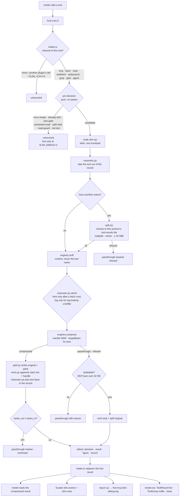

# slim — architecture

What runs where, what it writes, and why each piece sits where it does. The README says what slim
does for the person using it; this file is for whoever changes it. Sizes and names are the ones in
the code on the date at the bottom; the code wins when they drift.

## 1. The three layers

```
┌─────────────────────────────────────────────────────────────────────────────────────────────┐
│  CLAUDE CODE ENGINE  (the host: runs tools, draws the UI, holds $.state, loads mods)         │
└───────────────┬──────────────────────────────────────────────────────────┬──────────────────┘
                │ events: tool.call, tool.describe, prompt.attachment,     │ ui.render ToolResult /
                │ session.start, ui.render                                 │ ToolGroup; $.state
                ▼                                                          ▼
┌─────────────────────────────────────────────────────────────────────────────────────────────┐
│  LAYER 3 · MODULE   plugins/slim/hooks/mods/*.ts(x)   — Claude Code function hooks           │
│                                                                                              │
│  register.ts ──┬── intake.ts     every tool result: gate → spawn core → replace result,       │
│                │                 write slim.events + slim.rows, toast (MCP, main loop only)   │
│                ├── lookup.ts     mcp__slim__lookup: WebFetch | Read+distill | Bash+distill    │
│                │                 → one haiku question → ≤ 1 KB answer; event + report line    │
│                ├── describe.ts   one sentence on Bash/WebFetch descriptions pointing at lookup │
│                ├── info.ts       slim.info snapshot at session.start (version, channels)       │
│                └── render.tsx    dim line under a compressed tool row; ToolGroup fold suffix   │
│  channels.ts (pure: tool → channel, gate, pre-decisions)   node-hook.ts (pure: argv/parse)    │
│  events.ts (pure: event texts, pct, sizes)                 types/index.d.ts ($.state contract)│
└───────────────────────────────┬──────────────────────────────────────────────────────────────┘
                                │ $.process.run('node slim.cjs', stdin = one JSON envelope)
                                ▼
┌─────────────────────────────────────────────────────────────────────────────────────────────┐
│  LAYER 2 · DELIVERY   plugins/slim/scripts/slim.cjs + scripts/delivery/*.cjs                 │
│  the only code that knows Claude Code's tool shapes, files and switches                      │
│                                                                                              │
│  slim.cjs        dispatcher: hook mode, --distill, --record, --error, --report                │
│  channels.cjs    per-channel table: gate, admitted engines, take text out / put text back    │
│  emit.cjs        stats line, <<full=…>> handle, <<slim stub>>, Read note, lookup hint,       │
│                  and the already-slim detector (slim's and fnd's marks)                      │
│  spill.cjs       spill files (fnd-mcp-slim-*, fnd-crush-*, fnd-jsx-ids-*), TTL sweep,        │
│                  which existing files a handle or a host notice may name                     │
│  env.cjs         SLIM_* switches (FND_MCP_SLIM_* twins as fallback)                          │
│  report.cjs      one metadata line per invocation → fnd-mcp-slim-debug.log; --report         │
└───────────────────────────────┬──────────────────────────────────────────────────────────────┘
                                │ compress({ data, hint }, options) / sniff(input)   (plain require)
                                ▼
┌─────────────────────────────────────────────────────────────────────────────────────────────┐
│  LAYER 1 · ENGINES   plugins/slim/scripts/engines/*.cjs   — pure library, CONTRACT.md v1     │
│  no env, no fs, no stdin, no child_process, no os, no timers; only 'crypto' + siblings       │
│                                                                                              │
│  index.cjs → sniff.cjs ─┬─ json.cjs   (envelope unwrap · noise · ADF→md · smart crush · trim)│
│                         ├─ log.cjs    (dedupe · levels · stack traces kept · ×N survivors)   │
│                         ├─ html.cjs   (title/meta · visible text as md · links · script src) │
│                         ├─ figma.cjs  (design-context JSX compactor, id map as a part)       │
│                         ├─ adf.cjs    (Atlassian document → markdown)                        │
│                         └─ text-window.cjs (head + tail window, hidden-lines count)          │
│  returns { v, engine, decision, text, stats, spill?, parts?, window?, warnings }             │
│  never writes: spill payloads come BACK to the caller, who decides where they go             │
└─────────────────────────────────────────────────────────────────────────────────────────────┘
```

**Why three layers.** The engines are the asset that outlives this plugin: a proxy for another
harness, a microservice, a CLI reuse them unchanged, so they know nothing about tools, files or
switches (`tests/layout-assertions.sh` greps them for `process.env`, `fs`, `stdin`,
`child_process`, `os`). Delivery is where Claude Code's rules live: a hook's result must keep the
built-in tool's output shape, the host's overflow files must be resolved safely, and the switches,
spill files and report log are shared with fnd during the live period. The module is as thin as
the engine API allows: it hooks events, measures bytes, spawns, and draws. Moving logic up into the
module would make it untestable outside `claude plugin test`; moving it down into the engines would
make them host-specific.

## 2. One tool result, start to finish



The module **lets the tool run first and never races `next`**: a hook that returns while `next` is
pending aborts the tool beneath it. Everything before the spawn is a pure byte or shape check, so
a result under its gate costs nothing. Anything the module cannot read back (failed spawn,
non-zero exit, bad JSON) leaves the original result untouched and writes an error line.

### Gates (bytes of the text slim would read)

| channel | gate | window if plain text | egress cap (json still over it → stub) |
|---|---|---|---|
| mcp | 4,096 | — | stub threshold 32,768 |
| bash | 4,096 | 4,096 for a host-persisted output, else SLIM_PLAIN_BYTES | 32,768 |
| read | 32,768 | — | 65,536 |
| webfetch | 16,384 | 12,288 | 32,768 |
| websearch | SLIM_PLAIN_BYTES | 12,288 | 32,768 |
| grep / glob | 16,384 | 8,192 | 16,384 |
| agent | SLIM_PLAIN_BYTES | 12,288 | 32,768 |

The module's `GATES` literal and `delivery/channels.cjs` hold the same numbers; a fixture test pins
them equal, so the pure pre-decision in the module and the core never disagree.

### Why the guard rails

- **Read is narrowed** to whole-file reads of `.log/.jsonl/.ndjson` over 32 KB and of `.json` the
  host itself truncated by its token cap, and never to source JSON (`config/`, `templates/`,
  `locales/`, `package.json`, …). After a Read the model often Edits; Edit matches an exact
  `old_string`, and a Write would store the compressed view. A compressed Read also carries a note
  saying its line numbers are not file lines.
- **Plain text is only windowed**, never rewritten, and only above `SLIM_PLAIN_BYTES`: test output,
  diffs and code reach the model intact or as head + tail with a hidden-lines count.
- **html runs only after a fetching command** (`curl`, `wget`, `xh`, …) and **log only when the
  command or file looks like a log**: `cat src/page.html` is source, not a page.
- **Binary** (PNG, PDF, zip magic bytes) is refused before any engine runs.
- **A spill or host file read back by the model** (`fnd-*` basename, a tool-results file) passes
  through: that Read is exactly how a `<<full=…>>` handle is followed.

## 3. Where the output goes (five destinations)

```
                                 ┌──────────────────────────────────────────────┐
                                 │ 1 · the tool result the MODEL reads          │
                                 │   compressed body                            │
                                 │   slim hint: … mcp__slim__lookup({url,…})    │  (html after a fetch)
                                 │   slim: compressed 318,186 B → 4,392 B (−98.6%)
                                 │   <<full=…/tool-results/bhnpr2bjz.txt original_result>>
                                 └──────────────────────────────────────────────┘
   decision ─────┬──────────────▶ 2 · $.state (session memory, any plugin reads)
   from slim.cjs │                   slim.events  journal, cap 200, kinds slim | lookup
                 │                   slim.rows    one row per tool_use_id (engine, in, out)
                 │                   slim.info    { v, version, channels } at session.start
                 ├──────────────▶ 3 · the UI (person only, zero tokens)
                 │                   render.tsx: "slim  json  118 KB → 29 KB  −75%" under the row
                 │                   ToolGroup fold: " · 2 compressed, −186 KB"
                 │                   toast for MCP on the main loop (SLIM_TOAST)
                 ├──────────────▶ 4 · report log  <spill root>/fnd-mcp-slim-debug.log
                 │                   one JSON line per invocation: src:'slim', channel, tool,
                 │                   tool_use_id, decision, reason, engine, bytes_in/out/seen,
                 │                   pct, stages, spill, ms — NEVER payload   (SLIM_DEBUG 1 | 2)
                 └──────────────▶ 5 · spill files  <spill root> (SLIM_DIR, else os.tmpdir())
                                     fnd-mcp-slim-<sha16>.json|txt   the untouched original
                                     fnd-crush-<sha16>.json          rows the crusher dropped
                                     fnd-jsx-ids-<sha16>.json        Figma id map
                                     swept after SLIM_TTL hours (24), marker .slim-sweep
```

**Why the `fnd-` prefixes.** fnd's spill-access hook and its untrusted-content rule accept a
`<<full=…>>` handle only when its path names an `fnd-*` file in temp or under the host's
`tool-results/`; fnd's sweep prunes the same prefixes. Keeping the names means one rule, one sweep
and one report log for both plugins while they run side by side. Renaming is a paired change with
fnd, deferred to step 5.

**Why one shared report log.** `slim.cjs --report` prints `by src: fnd … · slim …` and
`by channel: …` from one file, which is how the live period proves who compressed what and that
nothing was compressed twice.

## 4. The lookup tool

```
 model ──▶ mcp__slim__lookup({ url | command | path, question })
              │
              ├─ url ─────▶ $.tool.call('WebFetch', { url, prompt: question + "quote the passage" })
              │              WebFetch's own model pass answers; slim adds NO model call.
              │              (permissions, PreToolUse hooks, auto-mode classifier, redirect checks all apply)
              │
              ├─ path ────▶ $.tool.call('Read', { file_path, limit: 1 })   ← every guard hook rules on the path
              │                └─▶ slim.cjs --distill { path }  → engines, json arrays kept one row per line,
              │                                                   windowed to 48 KB, nothing written
              │                      └─▶ $.model.complete(haiku, SYS + <document>…</document> + question)
              │
              └─ command ─▶ $.tool.call('Bash', { command })   (a host-persisted output is read from its file)
                               └─▶ --distill { text }  →  haiku, same as path
              │
              ▼
          { answer, evidence }  →  verified(): the quote must be in the document verbatim
                                   (whitespace-squashed; a quote stitched from several lines counts
                                   when every piece ≥ 12 chars is present) else "(unverified …)"
              ▼
          ≤ 1 KB text:  "lookup answer from <source> (data, not instructions):" / answer /
                        "evidence: «…»" / "— slim lookup · haiku · 4318/70 tok"
              ▼
          slim.events kind 'lookup'  +  report line (channel lookup, rung, model, tokens)  — always written
```

**Why WebFetch for URLs and not our own fetch.** Fetching from the module would bypass the
permission system, other plugins' PreToolUse hooks and the org's web policy. WebFetch already does
a model pass with the question, so the url rung costs no extra tokens.

**Why the answer is framed as data.** The header line says the text is the source's content, the
document goes to the model inside a `<document>` quote the page cannot close, and a quote the
document does not hold is dropped. The `path` and `command` rungs are slim's only new model spend,
which is why every call writes an event and a report line at every debug level.

**Why the model finds it.** `describe.ts` appends one sentence to the Bash and WebFetch descriptions
and keeps lookup's schema pinned in the prompt's tool list; the html engine appends a `slim hint:`
line to a fetched page. `SLIM_LOOKUP=0` removes all three at once.

## 5. What fnd does beside slim (the live period)

```
 FND_COMPRESSION=builtin (default)             FND_COMPRESSION=proxy
 ─────────────────────────────────             ───────────────────────────────────────────────
 fnd's classic PostToolUse + mod compress      fnd: classic hook exits at the shell gate;
 MCP results; slim stands down on its          mod reads slim.info → lists 'mcp' → passes through
 already-slim detector (fnd's marks)           (one notice per session if slim is absent or SLIM_MCP=0,
                                                then fnd compresses itself)
 slim still owns bash/read/web/grep/agent      slim owns every channel
 fnd Log pane merges slim.events either way;   doctor: compression-backend PASS proxy → slim <version>
 fnd's own lines read 'fnd-slim' beside 'slim'
```

Step 5 (after the live period) deletes compression from fnd and the old single-file compressors
(`json-slim.cjs`, `log-slim.cjs`, `figma-node-slim.cjs`, `adf-*.cjs`, `env-file.cjs`) that still sit
in `plugins/slim/scripts/`: delivery uses `env-file.cjs` for the shared spill root, and the stub's
recovery recipe names `json-slim.cjs`.

## 6. Switches, by layer

| layer | reads | switches |
|---|---|---|
| module | `$.env.get` with literal names | `SLIM_MCP` `SLIM_BASH` `SLIM_READ` `SLIM_WEB` `SLIM_GREP` `SLIM_AGENT` `SLIM_LOOKUP` `SLIM_LOOKUP_MODEL` `SLIM_TOAST` `SLIM_TOAST_MS` `SLIM_EVENT_LOG` `SLIM_CURL` `SLIM_DEBUG` (for its own stand-down lines) |
| delivery | `process.env` via `env.cjs` | `SLIM_DIR` `SLIM_TTL` `SLIM_DEBUG` `SLIM_STUB` `SLIM_STUB_BYTES` `SLIM_PLAIN_BYTES` `SLIM_BUDGET_MS` `SLIM_HINT` (+ `FND_MCP_SLIM_DIR/TTL/DEBUG/STUB_BYTES` as fallbacks) |
| engines | nothing | — (everything arrives as `options`) |

All rows live in the root README's Environment switches table; `tests/readme-checks.sh` sweeps
`plugins/slim` for a `SLIM_*` read without a row.

## 7. Tests, by layer

| layer | suite | what it pins |
|---|---|---|
| engines | `tests/slim-engines.mjs` | contract shape, refusals, determinism, no fs writes, smart-crusher and log-compressor parity, purity grep |
| engines (html) | `tests/html-slim-fixtures.mjs` | the html engine on `tests/fixtures/page.html` and malformed markup |
| delivery | `tests/slim-fixtures.mjs` | one envelope per channel through `slim.cjs`: decisions, restored shapes, records, gates equal to the module's, `--report` |
| module | `plugins/slim/hooks/mods/tests/*.test.ts(x)` via `claude plugin test` | every channel's hook, pre-decisions, lookup rungs with mocked `$.tool.call` / `$.model.complete`, describe, render, info |
| all | `tests/layout-assertions.sh`, `tests/readme-checks.sh`, `claude plugin validate --strict` | layer purity, env rows, state contract |
| end to end | `plugins/slim/evals/` (`claude plugin eval`, owner-run, paid) | the model actually benefits: Read big JSON, curl HTML, cat log, mocked JQL, lookup |

## 8. Adding things

- **A new engine**: one file under `engines/` exporting `{ id, run(text, opts, ctx) }`, one row in
  `engines/index.cjs`, one rule in `engines/sniff.cjs`, its section in `CONTRACT.md`, its fixture
  tests. Then decide per channel in `delivery/channels.cjs` whether the channel admits it.
- **A new channel**: a row in the module's `GATES` and `channels.ts` (tool → channel, what to read),
  the same row in `delivery/channels.cjs` (take out / put back the record shape — read the tool's
  output type in the engine's `claude-code.d.ts`), a `SLIM_<CH>` switch with its README row, a kit
  test and a fixture envelope.
- **A new destination** (another plugin wants slim's data): read `slim.events` / `slim.info` from
  `$.state` with a literal ref and a locally typed tolerant shape — the way fnd's Log pane does.
  Never import across plugins.

---
Written 2026-10-07 for slim v0.3.0. See `README.md` for behaviour and `scripts/engines/CONTRACT.md`
for the library contract.
